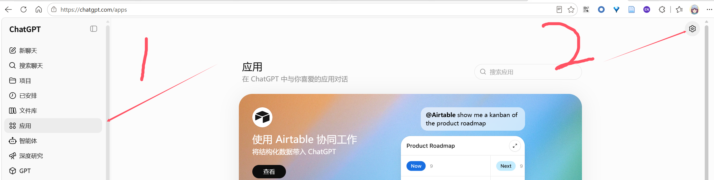
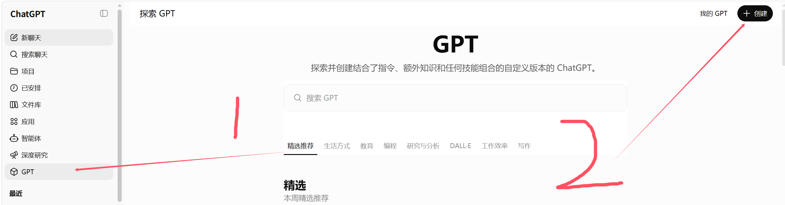

# WebCodex

[English](README.md) | [简体中文](README.zh-CN.md)

[](https://github.com/yyjeqhc/webcodex/actions/workflows/ci.yml)
[](https://www.npmjs.com/package/@yyjeqhc/webcodex)
[](LICENSE)

[下载最新版本](https://github.com/yyjeqhc/webcodex/releases/latest) ·
[0.3.4 发布说明](docs/RELEASE_NOTES_v0.3.4.zh-CN.md) ·
[完整文档](docs/INDEX.zh-CN.md)

**让在线 AI 窗口成为连接到你自己电脑和服务器的专属助手。**

WebCodex 把 ChatGPT、Claude 和其他 MCP 客户端连接到你的本地仓库、工作站与
服务器。你可以直接在熟悉的聊天窗口里让助手查看和修改文件、运行命令与测试、
操作 Git，并使用项目所在机器上已经安装的工具链完成真实任务。

| ChatGPT 通过 MCP 操作项目 | 查看变更与运行状态 |
| --- | --- |
|  |  |

## 三步开始

当前 package 支持 Linux x64、Linux arm64、macOS arm64 和 Windows x64；npm installer 需要
Node.js 18 或更新版本。

```bash
npm install -g @yyjeqhc/webcodex
cd /path/to/your/repository
webcodex connect https://sg4.yyjeqhc.cn
```

`connect` 默认把当前目录作为项目，创建本地 profile，启动 detached Runner，
并输出 MCP URL 与生成的 key。把这些信息添加到 ChatGPT 或 Claude 后，就可以直接
提出任务，例如：

```text
找出第一个失败的测试，修复原因，并重新运行相关测试。
```

自动生成的 key 只会在首次创建时完整显示。不要把它或生成的 `agent.toml` 提交到
Git。关闭终端不会停止 Runner；机器重启后，重新运行同一条 `connect`，或者使用
首次输出的 profile：

```bash
webcodex agent start --profile <profile>
```

### 临时分享本地项目

如果没有 hosted Server，只想临时把当前电脑上的项目接给 ChatGPT 或其他 MCP
client，可以直接使用 `webcodex share`。默认路径使用 Cloudflare Quick Tunnel，
不要求 Cloudflare 账号。

如果尚未安装 `cloudflared`，可以直接使用 Cloudflare
[官方安装说明](https://developers.cloudflare.com/tunnel/downloads/)中的命令：

```bash
# macOS
brew install cloudflared

# Debian / Ubuntu：把 Cloudflare 官方 APT 安装步骤合并成一条可直接复制的命令
sudo mkdir -p --mode=0755 /usr/share/keyrings && curl -fsSL https://pkg.cloudflare.com/cloudflare-main.gpg | sudo tee /usr/share/keyrings/cloudflare-main.gpg >/dev/null && echo "deb [signed-by=/usr/share/keyrings/cloudflare-main.gpg] https://pkg.cloudflare.com/cloudflared any main" | sudo tee /etc/apt/sources.list.d/cloudflared.list >/dev/null && sudo apt-get update && sudo apt-get install -y cloudflared
```

安装后直接分享当前项目：

```bash
cd /path/to/your/repository
webcodex share
```

`share` 会在需要时执行幂等 project setup，启动本地 Server + Agent，创建一把独立的
临时 Project Connector credential，并通过 Quick Tunnel 暴露 `/mcp`。WebCodex
不会静默安装系统软件包。输出的 HTTPS URL 和 Bearer credential 只对本次 share
session 有效；Ctrl-C 会停止 runtime 与 tunnel，并删除临时 credential。

在 ChatGPT Developer Mode 中，用输出的 `/mcp` URL 创建自定义 app。如果当前
workspace 提供 **访问令牌/API 密钥** 认证方式，选择它并粘贴本次临时 Bearer
credential，然后执行 **Scan Tools / 扫描工具**。ChatGPT 的 UI 文案和可用范围可能
随 workspace 与 rollout 变化。这把 credential 代表实时 coding 权限：在 share
session 存活期间，持有它的人可以修改当前项目并执行 share runtime 允许的命令。
请保持私密，并在使用完成后停止分享。

`webcodex share --tunnel none` 可用于纯本地 debug。Quick Tunnel 面向开发/测试，
不适合作为长期生产部署。如果机器上已经存在 `~/.cloudflared/config.yaml` 且 Quick
Tunnel 启动失败，需要注意 Cloudflare 当前不支持在该默认配置文件存在时使用 Quick
Tunnel；请使用独立的 Quick Tunnel 环境，或临时移开该文件。

Managed account、自定义 Server 和其他接入方式见
[AI 接入指南](docs/AI_ONBOARDING.zh-CN.md)。

## WebCodex 能做什么

- 在已注册项目中读取、搜索、创建和修改文件。
- 运行构建、测试、package script 和有界 shell 命令。
- 查看 Git 状态与 diff，并协助整理聚焦提交。
- 在多轮聊天中保留长任务和 coding context。
- 把多个项目或多台机器接入同一个在线助手。
- 同时支持 MCP client 和基于 OpenAPI 的 GPT Actions。

实际可用能力取决于 Server surface、Runner capability 和你配置的权限。WebCodex
既支持直接操作项目，也提供可选的 task/review 流程，并不限定为单一审批模式。

## 工作方式

```text
ChatGPT / Claude / 其他 MCP client
                 │ HTTPS：MCP 或 GPT Actions
                 ▼
          WebCodex Server
                 │ 已认证的 Runner transport
                 ▼
       你的工作站或服务器上的 Runner
                 │
                 └── 文件 · Git · 命令 · 测试 · 本地工具链
```

Server 负责连接、凭据和工具请求协调；真正的文件、Git 和命令操作由持有项目的
Runner 机器完成。仓库和本地工具链留在 Runner 主机上，连接中只传输当前工具调用
所需的输入与结果。

## 选择接入方式

| 目标 | 推荐方式 |
| --- | --- |
| 通过 hosted 服务接入一个项目 | 使用 `webcodex connect <server>`，本地只运行 Runner。 |
| 临时把当前本地项目接给 ChatGPT/MCP client | 使用 `webcodex share`，启动本地 Server + Agent 与临时 Quick Tunnel。 |
| 保持纯本地、不开放公网 | 使用 `webcodex setup` + `webcodex run`（share 调试也可用 `--tunnel none`）。 |
| 长期稳定部署 | 自托管 Server，并配置 stable HTTPS domain/tunnel、service 与按需 OAuth。 |
| 需要用户、设备 enrollment、撤销和审计 | 使用 managed `webcodex login` 流程。 |

## 使用 Docker 自托管 Server

仓库提供 server-only Dockerfile 和 Compose 部署。容器包含
`webcodex-server` 与管理用 `webcodex` CLI，但有意不包含 Runner、项目仓库或语言
工具链。

```bash
git clone https://github.com/yyjeqhc/webcodex.git
cd webcodex
./deploy/docker/bootstrap.sh https://webcodex.example.com
docker compose ps
```

默认只绑定 `127.0.0.1:8080`。在前面配置 HTTPS 反向代理，然后创建短期 pairing
code，把真正持有仓库的机器接入 Server。

当前 Compose 会从 checkout 源码构建镜像。以后可以单独发布 registry image，
但 server-only 架构不变。完整步骤见
[Docker 部署](docs/DOCKER_DEPLOYMENT.zh-CN.md)；systemd、OAuth 和生产运维见
[部署指南](docs/DEPLOYMENT.zh-CN.md)。

## 以普通用户运行 Runner

使用 managed 或自托管 Server 时，让实际拥有仓库的普通用户执行
`webcodex login`。登录输出会给出 Agent config 路径，可以不使用 `sudo` 安装为
user service：

```bash
webcodex agent install --scope user \
  --config /path/reported/by/login/agent.toml
webcodex agent status --scope user \
  --config /path/reported/by/login/agent.toml
```

System service 与高级覆盖参数见
[构建与安装](docs/BUILD_INSTALL.zh-CN.md#runner-service-scope)。

## 接入客户端

- **ChatGPT MCP：** 在 Developer Mode 中创建自定义 app，指向 Server 的 `/mcp`
  endpoint。使用 `webcodex share` 时，如果当前 workspace 提供 **访问令牌/API 密钥**，
  选择它并粘贴本次临时 Bearer credential。Managed 或自托管 HTTPS Server 可以使用
  OAuth；下面给出长期接入时的 ChatGPT OAuth 配置流程。
- **其他 MCP client：** 使用 Server 的 `/mcp` endpoint 和当前接入流程生成的
  credential。详见 [MCP](docs/MCP.zh-CN.md)。
- **GPT Actions：** 基于 OpenAPI 的 GPT Actions 仍作为另一种接入方式保留。
  详见 [GPT Actions](docs/GPT_ACTIONS.zh-CN.md)。
- **浏览器 console：** 打开 `/console` 查看连接信息、运行状态，以及当前可用的
  review 或运维操作。

### ChatGPT OAuth（Developer Mode）

对于已经配置公网 HTTPS 和 OAuth 的 managed / 自托管 WebCodex Server：

1. 在 ChatGPT 打开 **设置 → Apps → 创建**，Server URL 填
   `https://your-domain.example/mcp`，认证方式选择 **OAuth**，然后选择
   “用户自定义 / Custom OAuth client”。复制 ChatGPT 页面显示的 callback URL；
   每个 app 配置的 callback URL 都可能不同。
2. 在 WebCodex 注册这个**完全一致**的 callback URL。保存返回的
   `client_secret`，因为它只会显示一次。

   ```bash
   curl -fsS -X POST https://your-domain.example/api/oauth/clients/create \
     -H "Authorization: Bearer $WEBCODEX_PAT" \
     -H "Content-Type: application/json" \
     -d '{
       "name":"ChatGPT MCP",
       "redirect_uris":["https://chatgpt.com/connector/oauth/<callback-id>"],
       "allowed_scopes":["runtime:read","project:read","project:write","job:run"]
     }'
   ```
3. 把返回的 Client ID / Client Secret 填回 ChatGPT，并把令牌端点认证方式设为
   `client_secret_post`。只选择 app 真正需要的 WebCodex 权限；普通 coding 场景
   使用 `runtime:read`、`project:read`、`project:write`、`job:run` 即可，除非确实
   需要账号管理，否则不要勾选 `account:manage`。如果 ChatGPT 显示
   `offline_access`，保持勾选：WebCodex 把它作为 refresh token 的**协议级 scope**
   发布，它不会额外授予 WebCodex 权限，也不应写进 OAuth client 的
   `allowed_scopes`。
4. 执行 **Scan Tools / 扫描工具**。进入 WebCodex Authorization 页面后，使用普通
   WebCodex PAT 登录，检查请求的 scopes，点击 **Allow**，等待 ChatGPT 完成工具
   扫描。


**Scan Tools / 扫描工具** 成功后，ChatGPT 的 app 页面应显示发现到的 WebCodex operations。

ChatGPT 的 UI 文案可能变化。如果 OAuth discovery metadata 有更新，应重新创建
ChatGPT app，让它重新获取 metadata。服务端细节见 [MCP](docs/MCP.zh-CN.md)、
[部署指南](docs/DEPLOYMENT.zh-CN.md) 和
[OAuth2 smoke test](docs/OAUTH2_SMOKE_TEST.md)。

## 安全边界

WebCodex 可以修改文件并执行命令，应把已连接的客户端视为拥有真实开发权限的
助手。

- 只注册允许助手访问的项目根目录。
- 不要把 shared key、user token、Agent token 和生成的配置文件写入 prompt、日志
  或 Git。
- 开启写入与命令能力前，确保项目有版本控制和可恢复备份。
- Runner 优先使用普通 OS 用户；root 运行必须显式配置。

完整说明见 [SECURITY.md](SECURITY.md)。

## 文档

- [快速开始](docs/QUICK_START.zh-CN.md)
- [AI 接入指南](docs/AI_ONBOARDING.zh-CN.md)
- [构建与安装](docs/BUILD_INSTALL.zh-CN.md)
- [Docker 部署](docs/DOCKER_DEPLOYMENT.zh-CN.md)
- [MCP](docs/MCP.zh-CN.md)
- [GPT Actions](docs/GPT_ACTIONS.zh-CN.md)
- [部署与运维](docs/DEPLOYMENT.zh-CN.md)
- [完整文档索引](docs/INDEX.zh-CN.md)

## 从源码构建

```bash
cargo build --release --workspace --bins
export PATH="$PWD/target/release:$PATH"
```

## 免责声明

WebCodex 仅用于研究与学习。它能够在配置的项目边界内读取、修改文件并执行命令；
请只在能够恢复的系统与仓库中使用。若因使用本软件造成文件系统损坏、数据丢失或
其他后果，作者概不负责。

## 鸣谢

感谢 [LINUX DO](https://linux.do/) 社区提供的交流氛围与开源推广支持。

## License

Licensed under the Apache License, Version 2.0. See [LICENSE](LICENSE).
