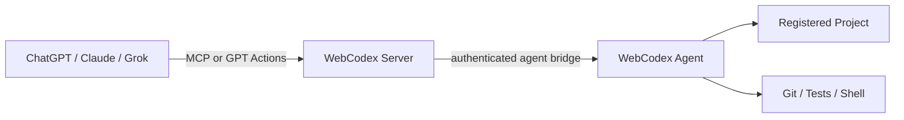
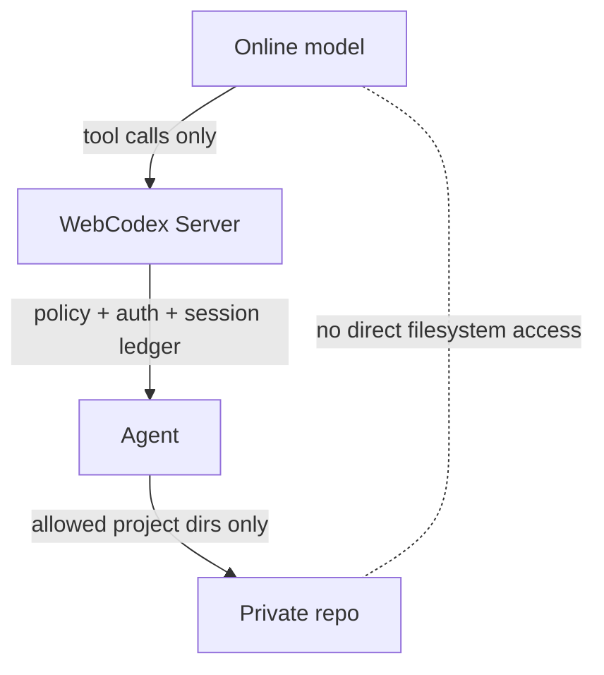
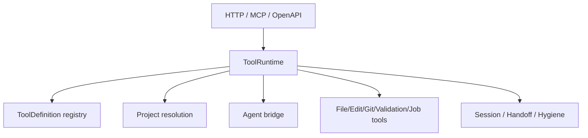

# Architecture

WebCodex is a self-hosted tool runtime that lets online AI clients operate private code through a server and a local execution agent. This document starts with the product architecture, then maps that architecture to the main Rust modules.

For vocabulary, read [CONCEPTS.md](CONCEPTS.md). For setup, read [QUICK_START.md](QUICK_START.md).

## 1. Client / Server / Agent / Codebase

The online client calls WebCodex over MCP or GPT Actions. The server authenticates the caller and dispatches runtime tool calls. The agent owns the local project boundary and performs approved file, Git, validation, shell, and job work.

## 2. Security Boundary

The model sees tool results, not arbitrary local files. Projects are registered by agents. The server does not scan the filesystem. Shell and job tools are bounded but powerful, so deployments should keep agent roots narrow and credentials scoped.

## 3. Runtime Module Map

The protocol adapters translate incoming requests into runtime tool calls. The ToolRuntime applies shared dispatch, project resolution, session recording, and domain tool behavior before routing agent-backed work to the agent bridge.

## Runtime Surfaces

- `runtime_http` exposes REST runtime routes, including generic runtime tool calls and dedicated project/file wrappers.
- `mcp` exposes the remote MCP endpoint backed by the same ToolRuntime.
- `openapi` builds the GPT Actions schema for the focused public operation surface.
- `tool_runtime` owns protocol-independent tool parsing, dispatch, project resolution, registry metadata, sessions, handoff, hygiene, files, Git, patches, Cargo validation, shell, jobs, artifacts, and checkpoints.

## Agent Bridge

- `shell_client` is the server-side agent registry and transport bridge. It tracks connected agents, project registrations, request/response flow, job updates, and agent policy summaries.
- `src/bin/webcodex_agent/*` owns the agent binary behavior: config loading, transport fallback, project registry parsing, file/patch/artifact/checkpoint handling, shell execution, and response shaping.

The agent is where private repository paths are interpreted. The server routes by runtime project id, such as `agent:<client_id>:<project_id>`.

## Auth, Policy, And Audit

- `auth` owns bearer authentication, principal modeling, scope constants, route gates, shared-key helpers, PAT verification, and OAuth token verification.
- `oauth_http` owns OAuth HTTP endpoints, consent, token exchange, revocation, metadata, and shared-key bridge UI.
- `db` owns persistence for users, tokens, agents, audit entries, OAuth rows, and schema migrations.
- Session and audit evidence is bounded and redacted. It is designed for task review and handoff, not for storing raw secrets, command bodies, or complete file contents.

## CLI And Operations

- `src/bin/webcodex_cli/*` owns setup and operations commands such as server bootstrap, connect, pairing, token creation, doctor checks, service installation, and profile handling.
- Deployment docs should use the CLI for management tasks rather than exposing management endpoints to GPT Actions or MCP.

## Frontend

The current product entry points are MCP, GPT Actions, REST, and CLI. Any frontend should remain an operator aid and should not become the model-facing trust boundary unless it uses the same runtime, auth, and session rules.

## Invariants For New Runtime Tools

When adding or renaming a runtime tool, keep these synchronized in the same change:

- `ToolCall` parsing and known tool names.
- Tool metadata and registry schema.
- OAuth scope policy.
- MCP `tools/list`.
- GPT Actions accepted names, examples, and flattened fields when applicable.
- Consistency tests.

Default to exposing new specialized behavior through the generic runtime tool path unless there is a clear product reason and GPT Actions operation-count budget for a dedicated operation.
