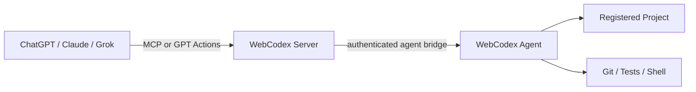
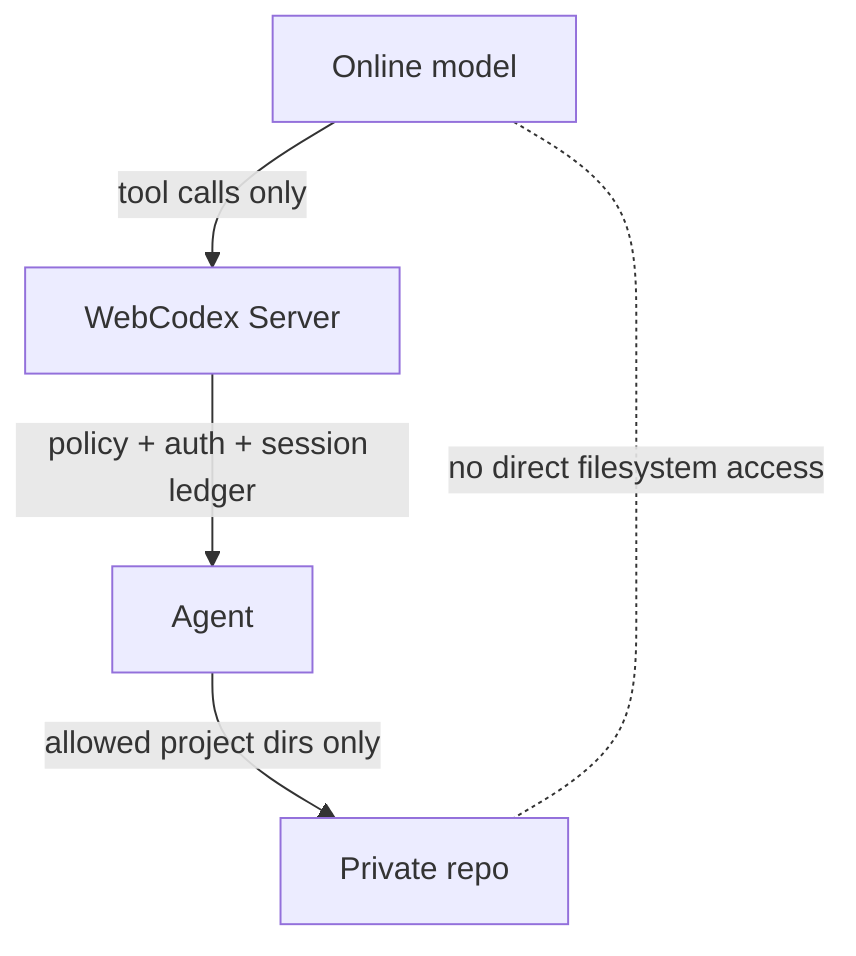
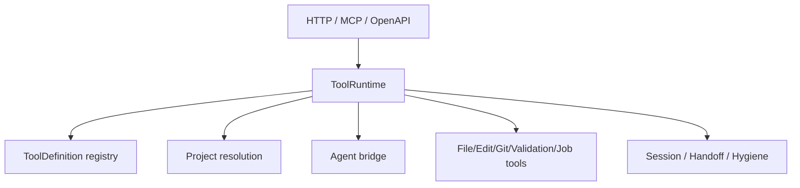
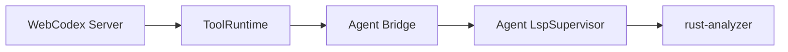

# Architecture

WebCodex is a self-hosted tool runtime that lets online AI clients operate private code through a server and a local execution agent. This document starts with the product architecture, then maps that architecture to the main Rust modules.

For vocabulary, read [CONCEPTS.md](CONCEPTS.md). For setup, read [QUICK_START.md](QUICK_START.md).

## 1. Client / Server / Agent / Codebase



The online client calls WebCodex over MCP or GPT Actions. The server authenticates the caller and dispatches runtime tool calls. The agent owns the local project boundary and performs approved file, Git, validation, shell, and job work.

## 2. Security Boundary



The model sees tool results, not arbitrary local files. Projects are registered by agents. The server does not scan the filesystem. Shell and job tools are bounded but powerful, so deployments should keep agent roots narrow and credentials scoped.

## 3. Runtime Module Map



The protocol adapters translate incoming requests into runtime tool calls. The ToolRuntime applies shared dispatch, project resolution, session recording, and domain tool behavior before routing agent-backed work to the agent bridge.

## Runtime Surfaces

- `runtime_http` exposes REST runtime routes, including generic runtime tool calls and dedicated project/file wrappers.
- `mcp` exposes the remote MCP endpoint backed by the same ToolRuntime.
- `openapi` builds the GPT Actions schema for the focused public operation surface.
- `tool_runtime` owns protocol-independent tool parsing, dispatch, project resolution, registry metadata, sessions, handoff, hygiene, files, Git, patches, Cargo validation, shell, jobs, artifacts, and checkpoints.

## Agent Bridge

- `shell_client` is the server-side agent registry and transport bridge. It tracks connected agents, project registrations, request/response flow, job updates, and agent policy summaries.
- `src/bin/webcodex_agent/*` owns the agent binary behavior: config loading, transport fallback, project registry parsing, file/patch/artifact/checkpoint handling, shell execution, and response shaping.
- `src/bin/webcodex_agent/lsp/*` owns the Rust-only LSP process supervisor and read-only navigation handlers. Results use project-relative paths, 1-based Unicode scalar columns, bounded truncation, and omit external (registry/sysroot) locations.
- `tool_runtime::semantic_navigation` builds the always-present compact `start_coding_task.semantic_navigation` capability summary. It sends only typed `AgentLspRequest::Status` under one two-second deadline and parses the versioned result contract directly, without recursively dispatching the public `lsp_status` ToolCall or recording a nested session event. Agent status resolution may inspect Cargo workspace presence, executable availability, and an existing supervisor slot, but it never starts rust-analyzer, runs Cargo or shell commands, or retrieves symbol/location data. The summary is Rust-only, read-only, workspace-only, dependency-limited by `cargo.noDeps=true`, and marked `full_text_sync_only`: validated workspace `.rs` files refresh open LSP documents from current disk content, without editor-style incremental synchronization. Probe failure or unavailability remains optional acceleration metadata and does not affect the coding startup verdict or warnings.

The agent is where private repository paths are interpreted. The server routes by runtime project id, such as `agent:<client_id>:<project_id>`.

### Agent-Side LSP Architecture



The LSP process runs only on the agent, at the canonical root of a registered project. The server never reads agent project files directly and does not spawn a shell to run LSP work. Typed bridge requests preserve the project boundary and do not permit arbitrary LSP-method or JSON-RPC parameter passthrough. The rust-analyzer profile is constrained: `cargo.noDeps=true`, build scripts and proc macros are disabled, and `checkOnSave` is disabled. It does not install rust-analyzer, download dependencies, execute project build scripts, or run Cargo check.

Public read-only intelligence tools (`lsp_status`, `document_symbols`, `goto_definition`, `find_references`, `document_diagnostics`, `hover`, and `workspace_symbols`) follow the path shown above. Validated workspace `.rs` files are read from current disk content; the first preparation sends `didOpen` version 1, changed content sends a monotonic full-text `didChange`, identical content sends nothing, and a restarted server instance opens again at version 1. This is disk-backed full-text refresh, not editor-style incremental synchronization. Diagnostics availability is optional feedback and does not lower `start_coding_task`'s startup verdict.

Diagnostics use rust-analyzer's `textDocument/publishDiagnostics` path because this supervisor profile has a reliable notification flow and does not assume pull-diagnostic support. Each server instance keeps only the latest publication for at most 256 URIs and at most 500 raw diagnostics per URI. A Condvar wait shares one two-second deadline. `fresh=true` means the cache version matches the prepared document or a matching publication arrived after preparation; `timed_out=true` returns the latest stale cache (or an empty result) as a normal tool success. Restarting the server clears the cache. This is quick semantic feedback under the constrained profile, not Cargo check.

Hover content is normalized to bounded markdown/plaintext without interpreting it. Workspace symbols are sorted, deduplicated, limited on the agent, filtered to canonical project `.rs` files, and returned with project-relative paths only. Registry, sysroot, dependency, absolute-path, file-URI, executable-path, environment, and raw process-output material never belongs in public results. Public positions remain 1-based Unicode scalar coordinates while the agent converts the negotiated UTF-8, UTF-16, or UTF-32 encoding internally.

## Validation Intelligence

Validation evidence follows one shared path rather than a parallel verdict model:

```text
bounded validation-tool result metadata
        -> session ledger
        -> structured_validation_parser v3
        -> validation_events aggregation
        -> finish_coding_task / session_handoff_summary / validation_summary
```

The parser is deterministic and fail-closed. It consumes only the bounded, sanitized metadata captured for the existing validation-tool allowlist; ordinary `run_shell` output is not validation evidence. It returns at most 20 cargo diagnostics and 20 failed-test details, uses project-relative safe locations, truncates diagnostic messages at 240 Unicode scalars, and never stores or returns full stdout/stderr, commands, environment variables, panic bodies, assertion values, or backtraces. It classifies event evidence conservatively as `compile_error`, `test_failure`, `timeout`, `process_exit`, `format_diff`, or `unknown`; this evidence never changes whether the underlying validation call succeeded.

`validation_events` continues to own `status`, `latest_status`, and `historical_failures`. A failed-then-passed sequence therefore remains `status=mixed`, reports `latest_status=passed`, and keeps the resolved failure for audit without lowering the final task outcome. A successful zero-test `cargo_test` cannot resolve an earlier cargo-test failure. Parser unavailability or truncation changes only evidence completeness, never verdict semantics.

`validation_summary` is a project-read, explicit-session query over this same aggregation. It does not execute Cargo or shell, enqueue an agent request, read project files, mutate the workspace, or record itself as validation evidence. It is useful for a fresh MCP window or review, but it does not replace `finish_coding_task`, which also evaluates workspace, jobs, hygiene, failure expectations, evidence integrity, and the final closeout verdict.

## Auth, Policy, And Audit

- `auth` owns bearer authentication, principal modeling, scope constants, route gates, shared-key helpers, PAT verification, and OAuth token verification.
- `oauth_http` owns OAuth HTTP endpoints, consent, token exchange, revocation, metadata, and shared-key bridge UI.
- `db` owns persistence for users, tokens, agents, audit entries, OAuth rows, and schema migrations.
- Session and audit evidence is bounded and redacted. It is designed for task review and handoff, not for storing raw secrets, command bodies, or complete file contents.

## CLI And Operations

- `src/bin/webcodex_cli/*` owns setup and operations commands such as server bootstrap, connect, pairing, token creation, doctor checks, service installation, and profile handling.
- Deployment docs should use the CLI for management tasks rather than exposing management endpoints to GPT Actions or MCP.

## Frontend

The current product entry points are MCP, GPT Actions, REST, and CLI. Any frontend should remain an operator aid and should not become the model-facing trust boundary unless it uses the same runtime, auth, and session rules.

## Invariants For New Runtime Tools

When adding or renaming a runtime tool, keep these synchronized in the same change:

- `ToolCall` parsing and known tool names.
- Tool metadata and registry schema.
- OAuth scope policy.
- MCP `tools/list`.
- GPT Actions accepted names, examples, and flattened fields when applicable.
- Consistency tests.

Default to exposing new specialized behavior through the generic runtime tool path unless there is a clear product reason and GPT Actions operation-count budget for a dedicated operation.

### ToolDefinition Dead-Code Hygiene

`src/tool_runtime/tool_definition.rs` must not use a module-wide `#![allow(dead_code)]`.
During the ToolDefinition migration, unused residue should be removed when
possible. Test-only helpers should be placed behind `#[cfg(test)]`, and any
remaining temporary compatibility allowance must be item-scoped rather than
module-wide.

Schema migration tests enforce this documentation so the tool surface does not
quietly accumulate broad dead-code allowances while ToolDefinition, ToolCall,
MCP, OpenAPI, and metadata stay synchronized.
