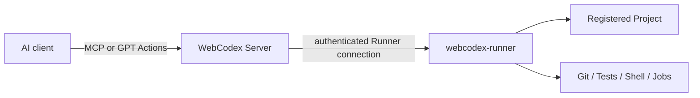
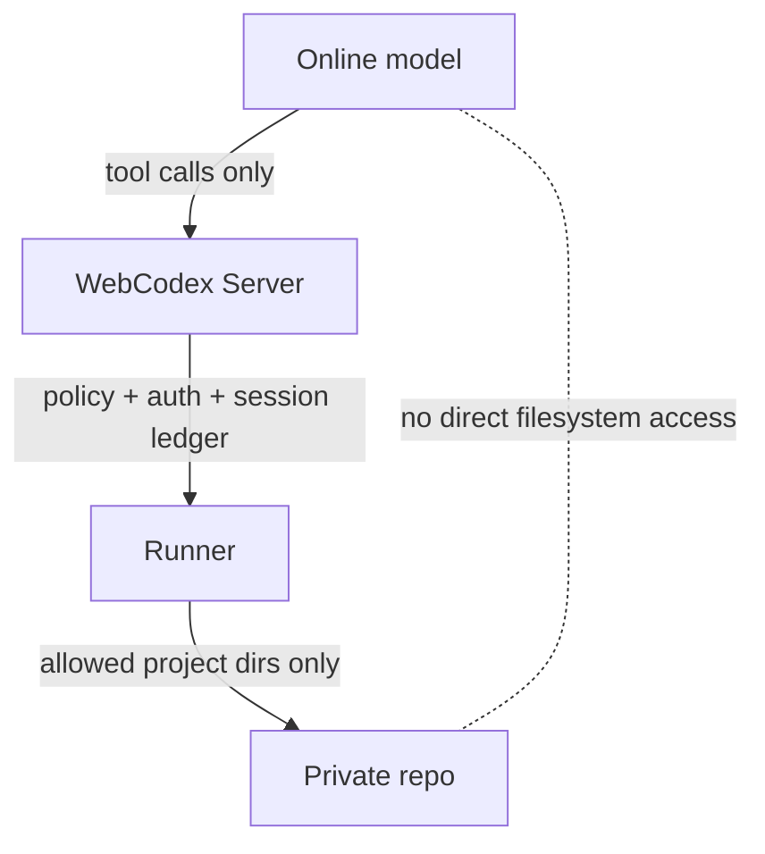

# Architecture

WebCodex is a self-hosted tool runtime that lets online AI clients operate
private code through a Server and a local Runner, while the Server can also retain
durable Agent/Conversation state independently of a browser window. This page is a
conceptual overview; the [CLI](CLI.md), [Runner](RUNNER.md), [Deployment](DEPLOYMENT.md),
and [Authentication](AUTH_MODEL.md) guides cover the operational details.

For a short definition of the terms, see the terminology sections in
[CLI](CLI.md#terminology) and [Runner](RUNNER.md#core-terms).

## Client → Server → Runner → project


```mermaid
flowchart LR
  C[AI client] -->|MCP or GPT Actions| S[WebCodex Server]
  S -->|authenticated Runner connection| R[webcodex-runner]
  R --> P[Registered Project]
  R --> G[Git / Tests / Shell / Jobs]
```

The online client calls WebCodex over MCP or GPT Actions. The Server
authenticates the caller, applies policy, and routes runtime tool calls to a
connected Runner. The Runner owns the local project boundary and performs the
file, Git, validation, shell, and Job work on the machine that has the code.

The Server never scans your filesystem and never reads project files directly.
Projects are registered by Runners; the Server addresses them by runtime
project id `agent:<client_id>:<project_id>`.

## Product surfaces

WebCodex exposes the same Server/Runner runtime through several user-facing adapters:

- **MCP** — the recommended model-facing integration for ChatGPT, Claude, and other MCP clients.
- **GPT Actions** — the OpenAPI integration for Custom GPTs that do not use MCP directly.
- **REST** — the Server HTTP runtime API.
- **CLI** — operator/developer setup, lifecycle, and diagnostics.
- **Console** — the Server-hosted operator browser surface.

For daily use, a regular Server + Runner exposes the configured coding tools for registered Projects. `webcodex share` / `webcodex run` instead create a project-first Connector bound to one repository and use a smaller task-oriented workflow. These are product choices, not identities or credentials.

Internal type names used to route these adapters are maintainer implementation details; ordinary users should follow the tools and connection instructions returned by the current Server.

## Project registration

Projects live on the Runner machine. The Runner registers allowed directories
with the Server; the Server does not discover project paths on its own. A
runtime project id addresses one registered project:

```text
agent:<client_id>:<project_id>
```

`client_id` is the stable logical identifier of a Runner/device; `project_id`
is the id registered by that Runner in its `project-registry` registry.
`allowed_roots` controls where projects may be registered or created (default
`$HOME`; an explicit list narrows it).

## Durable Agent and asynchronous work

The Server also owns a durable Agent/Conversation domain for communication and asynchronous work. A Durable Agent is separate from a Runner/device, browser window, credential, Project, and Workflow Session.

This separation matters because the historical `agent:` prefix still appears in some Runner/runtime compatibility identifiers. That prefix does not turn a Runner or runtime Project into a Durable Agent.

Conversation membership and Durable Agent identity grant only the communication/workflow authority defined by that domain; they do not grant repository, Runner, filesystem, Job, or Workflow Session access.

Maintainer-level lifecycle and Agent Task/TaskAttempt details live in [Durable Agent runtime and asynchronous work](architecture/durable-agent-runtime.md) and [Durable Agent/Conversation/Wake contract](architecture/durable-agent-conversation.md).

## Task, Job, and Workflow Session continuity

- **Connector Task** — project-first work created by the task-oriented Connector. It can be explicitly resumed by its task handle.
- **Job** — a long-running command or validation that continues after the initiating call returns. Observe the same Job instead of starting another copy.
- **Workflow Session** — bounded coding evidence/continuity used by the regular runtime for review, validation, collaboration, and closeout. It is not a credential.

These objects have different lifecycles and are never inferred from one another merely because requests share a user, credential, project, or chat window. Their exact continuity protocols are maintainer details.

## Runner execution boundary

The Runner is the trust boundary closest to the repository:

- Projects execute only inside registered project roots and the configured
  `allowed_roots` policy.
- Shell and Job tools are bounded escape hatches, not the default coding loop.
  Structured read, edit, and validation tools are preferred.
- Shell profiles prepare a one-time environment snapshot per project/profile;
  `~/.bashrc` / `~/.profile` are not sourced by default.
- The Runner connects out to the Server over QUIC, WebSocket, or polling, and
  reconnects automatically. A disconnect is a liveness fact, not a lost-work
  fact: active Jobs enter a bounded `recovering` state and are restored from
  the Runner's inventory when the same instance reconnects.

## Security boundary


```mermaid
flowchart TD
  M[Online model] -->|tool calls only| S[WebCodex Server]
  S -->|policy + auth + session ledger| R[Runner]
  R -->|allowed project dirs only| P[Private repo]
  M -. no direct filesystem access .- P
```

The model sees tool results, not arbitrary local files. Access is bounded by:

- bearer authentication mapping to a principal,
- scoped user tokens for the client surfaces,
- Runner tokens bound to a `client_id` for transport,
- `allowed_roots` and path policy on the Runner,
- an authority mode that decides whether consequential tools auto-execute or
  require human approval,
- bounded, redacted session evidence.

See [SECURITY.md](../SECURITY.md) and [AUTH_MODEL.md](AUTH_MODEL.md).

## Persistence and recovery

The Server persists managed accounts, OAuth state, project/task history, and durable Agent/Conversation state. Workflow/task continuity is restored from its own durable identifiers; WebCodex does not invent continuity from a credential or current browser window.

Runner Jobs are reconciled when the same live Runner process reconnects. Ordinary child processes cannot be adopted by an unrelated replacement Runner; specialized detached execution has its own explicit durable ownership path. The stable Runner `client_id` and the current process lease are separate, but the exact lease field is an internal wire detail.

## Module map

```text
MCP / OpenAPI / Runtime HTTP --> ToolRuntime --+--> Project resolution --> Runner bridge
                                               |      |--> File/Edit/Git/Validation/Job tools
                                               |      +--> Workflow Session / Handoff / Hygiene
                                               +--> Durable Agent / Conversation / Delivery / Wake
Runtime Console -----------------------> canonical Server HTTP/kernel paths above
```

- `runtime_http` — REST runtime routes.
- `mcp` — the MCP adapter and surface selection.
- `openapi` — the GPT Actions schema.
- `connector_runtime` — the canonical project-bound coding path.
- `tool_runtime` — protocol-independent tool parsing, dispatch, project
  resolution, registry metadata, sessions, handoff, hygiene, files, Git,
  patches, validation, shell, Jobs, artifacts, and checkpoints.
- `auth` / `oauth_http` / `db` — authentication, OAuth endpoints, and
  persistence.
- `webcodex-runner` crates — the Runner binary: config, transport, project
  registry, file/patch/artifact handling, shell execution, and LSP
  navigation.

### Cargo workspace ownership layers

The checked-in [`workspace-boundaries.toml`](../workspace-boundaries.toml) is the
machine policy for direct dependencies between Cargo workspace packages. It
records every workspace package, its ownership role, and its exact normal,
development, and build-time workspace dependencies. Production dependencies
may stay within a layer or point toward a lower layer; explicit development
dependencies are test-only exceptions. Uses of the `root-test-support` feature
are separately pinned to declared development dependencies.

The current layers are:

- **leaf** — `webcodex-core`, `webcodex-process`, `webcodex-computer`, and
  `webcodex-admin`; these do not depend on another workspace package.
- **domain** — Runner config/registry, Store, Workspace, Workflow Session,
  Tool contracts, Validation, and Persistent Shell ownership.
- **runtime** — `webcodex-runner` and `webcodex-tool-runtime-contracts`.
- **application** — `webcodex-connector-runtime`, which composes the domain
  crates needed by the project-bound Connector path.
- **composition** — the root `webcodex` package, which owns Server composition
  and protocol adapters rather than forcing those concerns into lower crates.
- **entrypoint** — `webcodex-cli`, the user-facing executable over the lower
  composition and setup crates.

CI validates this policy from `cargo metadata`; adding a workspace crate or a
new direct workspace dependency therefore requires an intentional policy
update rather than silently changing the architecture.

## Further reading

- [Durable Agent runtime and asynchronous work](architecture/durable-agent-runtime.md) — persistent Agent identity and planned asynchronous Agent work
- [Durable Agent/Conversation/Wake contract](architecture/durable-agent-conversation.md) — current communication implementation
- [CLI](CLI.md) — commands and terminology
- [Runner](RUNNER.md) — the execution boundary and operations
- [Deployment](DEPLOYMENT.md) — self-hosting
- [Authentication](AUTH_MODEL.md) — credentials
- [MCP](MCP.md) — model-facing surface
- [SECURITY.md](../SECURITY.md) — security model
