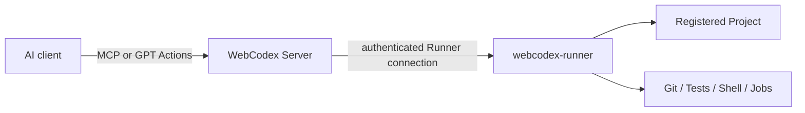
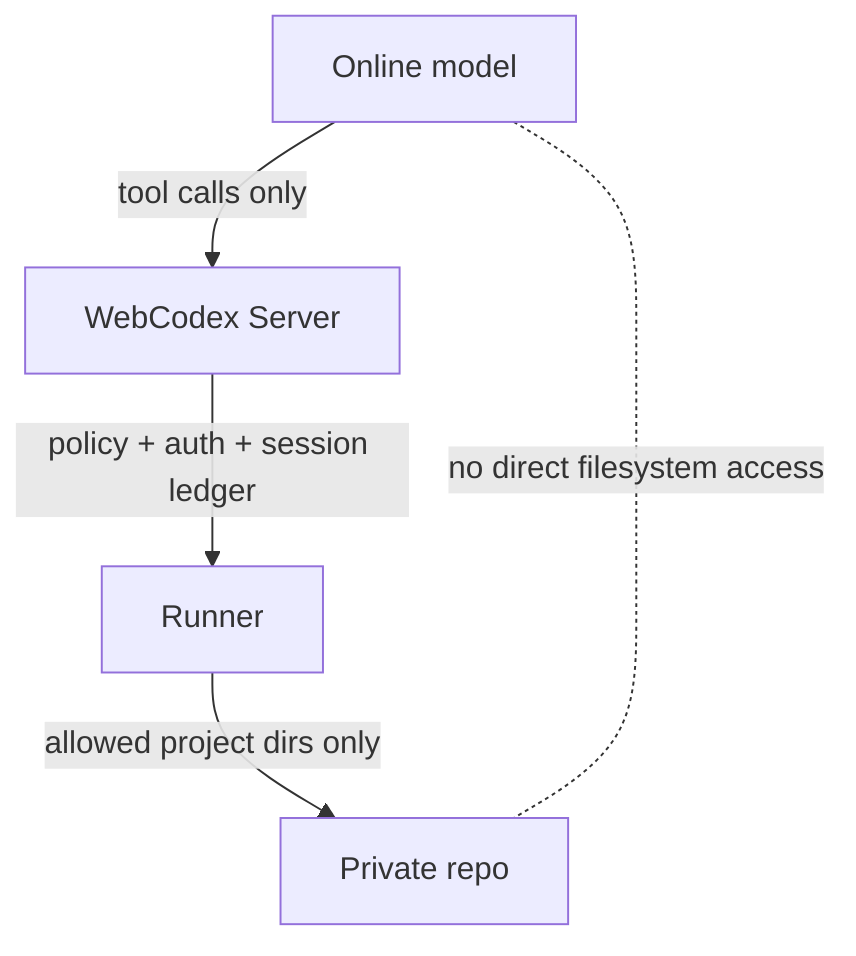

# Architecture

WebCodex is a self-hosted tool runtime that lets online AI clients operate
private code through a Server and a local Runner. This page is a conceptual
overview; the [CLI](CLI.md), [Runner](RUNNER.md), [Deployment](DEPLOYMENT.md),
and [Authentication](AUTH_MODEL.md) guides cover the operational details.

For a short definition of the terms, see the terminology sections in
[CLI](CLI.md#terminology) and [Runner](RUNNER.md#server-cli-runner-agent).

## Client → Server → Runner → project


```mermaid
flowchart LR
  C[AI client] -->|MCP or GPT Actions| S[WebCodex Server]
  S -->|authenticated Runner connection| R[webcodex-runner]
  R --> P[Registered Project]
  R --> G[Git / Tests / Shell / Jobs]
```

The online client calls WebCodex over MCP or GPT Actions. The Server
authenticates the caller, applies policy, and routes runtime tool calls to a
connected Runner. The Runner owns the local project boundary and performs the
file, Git, validation, shell, and Job work on the machine that has the code.

The Server never scans your filesystem and never reads project files directly.
Projects are registered by Runners; the Server addresses them by runtime
project id `agent:<client_id>:<project_id>`.

## Surfaces

WebCodex exposes the same runtime through several thin adapters:

- **MCP** — a startup-selected model-facing surface. A complete project-first
  Connector configuration selects the fourteen-capability `canonical_connector`
  surface; without Connector configuration, MCP defaults to the broader
  `local_coding` surface. `full_operator_runtime` is an explicit advanced
  surface for management tooling.
- **GPT Actions** — `/openapi.json` follows the Server mode: a configured
  Connector returns the project-bound Connector schema, while a generic Server
  returns the standard runtime OpenAPI schema.
- **REST** — the Server's HTTP runtime API.
- **CLI** — the operator/developer command-line interface.
- **Console** — a read-only browser view of project readiness and review.

All adapters share the same Server, project registration, authentication, and
policy boundaries. The project-bound Connector is the canonical project-first
path; generic Servers expose their configured runtime surfaces instead.

## Project registration

Projects live on the Runner machine. The Runner registers allowed directories
with the Server; the Server does not discover project paths on its own. A
runtime project id addresses one registered project:

```text
agent:<client_id>:<project_id>
```

`client_id` is the stable logical identifier of a Runner/device; `project_id`
is the id registered by that Runner in its `projects.d` registry.
`allowed_roots` controls where projects may be registered or created (default
`$HOME`; an explicit list narrows it).

## Task / Job / session continuity

- **Task** — a bounded unit of project work created by the model and reviewed
  by a human. A project-bound Connector binds a chat window to its active task,
  so follow-up instructions continue the same repository context. Tasks are
  durable and can be resumed.
- **Job** — a long-running command or validation that continues after the
  initiating call returns. A single execution is promoted to a Job with the
  same `job_id` when it outlives the synchronous grace period; it is never
  restarted. Jobs have bounded logs and can be stopped.
- **Workflow Session** — the operator runtime's bounded evidence ledger for a
  long-lived coding session. It records tool names, status, project ids,
  validation summaries, and permission decisions — never raw secrets or full
  file contents. Connector users do not manage session ids.

## Runner execution boundary

The Runner is the trust boundary closest to the repository:

- Projects execute only inside registered project roots and the configured
  `allowed_roots` policy.
- Shell and Job tools are bounded escape hatches, not the default coding loop.
  Structured read, edit, and validation tools are preferred.
- Shell profiles prepare a one-time environment snapshot per project/profile;
  `~/.bashrc` / `~/.profile` are not sourced by default.
- The Runner connects out to the Server over QUIC, WebSocket, or polling, and
  reconnects automatically. A disconnect is a liveness fact, not a lost-work
  fact: active Jobs enter a bounded `recovering` state and are restored from
  the Runner's inventory when the same instance reconnects.

## Security boundary


```mermaid
flowchart TD
  M[Online model] -->|tool calls only| S[WebCodex Server]
  S -->|policy + auth + session ledger| R[Runner]
  R -->|allowed project dirs only| P[Private repo]
  M -. no direct filesystem access .- P
```

The model sees tool results, not arbitrary local files. Access is bounded by:

- bearer authentication mapping to a principal,
- scoped user tokens for the client surfaces,
- Runner tokens bound to a `client_id` for transport,
- `allowed_roots` and path policy on the Runner,
- an authority mode that decides whether consequential tools auto-execute or
  require human approval,
- bounded, redacted session evidence.

See [SECURITY.md](../SECURITY.md) and [AUTH_MODEL.md](AUTH_MODEL.md).

## Persistence and recovery

The Server persists users, tokens, projects, audit entries, and OAuth rows in a
SQLite database. Task history and per-repository window mappings are durable.
Process-local "currently viewed project" state is deliberately discarded on
restart; a client that retains its transport window identity restores the
matching repository on its next `task_start`, and an explicit durable task id
recovers it otherwise.

Runner Job state is reconciled from the Runner's inventory on reconnect. A
Runner process restart cannot recover its old child processes; those Jobs
become `lost`.

`client_id` is the stable logical identity of a Runner/device; each live
process additionally carries an `agent_instance_id` (generated at startup)
that the Server uses as the active lease identity: a second process with the
same `client_id` but a different `agent_instance_id` is rejected while the
first is online, and a stale/replaced instance can no longer poll or submit
results.

## Module map

```text
HTTP / MCP / OpenAPI --> ToolRuntime --> Project resolution --> Agent bridge
                                                  |--> File/Edit/Git/Validation/Job tools
                                                  |--> Session / Handoff / Hygiene
```

- `runtime_http` — REST runtime routes.
- `mcp` — the MCP adapter and surface selection.
- `openapi` — the GPT Actions schema.
- `connector_runtime` — the canonical project-bound coding path.
- `tool_runtime` — protocol-independent tool parsing, dispatch, project
  resolution, registry metadata, sessions, handoff, hygiene, files, Git,
  patches, validation, shell, Jobs, artifacts, and checkpoints.
- `auth` / `oauth_http` / `db` — authentication, OAuth endpoints, and
  persistence.
- `webcodex-runner` crates — the Runner binary: config, transport, project
  registry, file/patch/artifact handling, shell execution, and LSP
  navigation.

## Further reading

- [CLI](CLI.md) — commands and terminology
- [Runner](RUNNER.md) — the execution boundary and operations
- [Deployment](DEPLOYMENT.md) — self-hosting
- [Authentication](AUTH_MODEL.md) — credentials
- [MCP](MCP.md) — model-facing surface
- [SECURITY.md](../SECURITY.md) — security model
