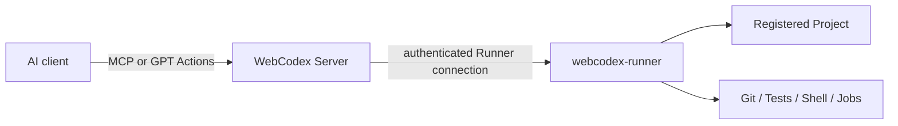
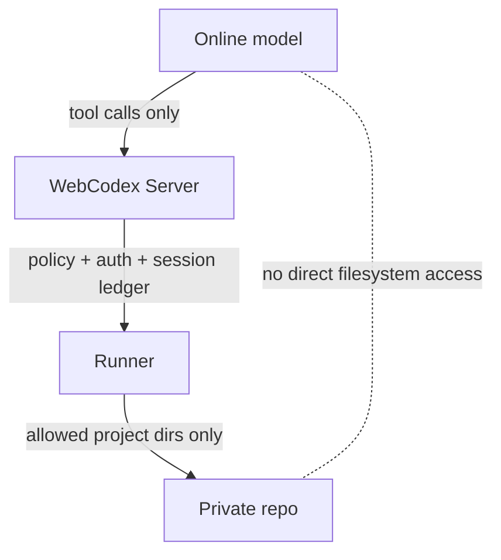

# Architecture

WebCodex is a self-hosted tool runtime that lets online AI clients operate
private code through a Server and a local Runner, while the Server can also retain
durable Agent/Conversation state independently of a browser window. This page is a
conceptual overview; the [CLI](CLI.md), [Runner](RUNNER.md), [Deployment](DEPLOYMENT.md),
and [Authentication](AUTH_MODEL.md) guides cover the operational details.

For a short definition of the terms, see the terminology sections in
[CLI](CLI.md#terminology) and [Runner](RUNNER.md#core-terms).

## Client → Server → Runner → project


```mermaid
flowchart LR
  C[AI client] -->|MCP or GPT Actions| S[WebCodex Server]
  S -->|authenticated Runner connection| R[webcodex-runner]
  R --> P[Registered Project]
  R --> G[Git / Tests / Shell / Jobs]
```

The online client calls WebCodex over MCP or GPT Actions. The Server
authenticates the caller, applies policy, and routes runtime tool calls to a
connected Runner. The Runner owns the local project boundary and performs the
file, Git, validation, shell, and Job work on the machine that has the code.

The Server never scans your filesystem and never reads project files directly.
Projects are registered by Runners; the Server addresses them by runtime
project id `agent:<client_id>:<project_id>`.

## Product surfaces

WebCodex exposes the same Server/Runner runtime through several user-facing adapters:

- **MCP** — the recommended model-facing integration for ChatGPT, Claude, and other MCP clients.
- **GPT Actions** — the OpenAPI integration for Custom GPTs that do not use MCP directly.
- **REST** — the Server HTTP runtime API.
- **CLI** — operator/developer setup, lifecycle, and diagnostics.
- **Console** — the Server-hosted operator browser surface.

A regular Server + Runner and the local `webcodex share` / `webcodex run` lifecycle all expose the ordinary WebCodex runtime. `share` and `run` are deployment/auth/reachability conveniences around one locally registered Project; they do not define a second coding runtime or task model. Their project-scoped credentials restrict which Runner/Project is visible without changing ToolRuntime semantics.

Internal type names used to route these adapters are maintainer implementation details; ordinary users should follow the tools and connection instructions returned by the current Server.

## Project registration

Projects live on the Runner machine. The Runner registers allowed directories
with the Server; the Server does not discover project paths on its own. A
runtime project id addresses one registered project:

```text
agent:<client_id>:<project_id>
```

`client_id` is the stable logical identifier of a Runner/device; `project_id`
is the id registered by that Runner in its `project-registry` registry.
`allowed_roots` controls where projects may be registered or created (default
`$HOME`; an explicit list narrows it).

For the regular coding runtime, `work_on_project` can optionally collapse a
source-checkout bootstrap into the same authority path. With `mode=worktree` and
`client_id + path`, the Runner resolves the requested Git base to an exact commit,
chooses a Runner-owned managed-worktree location under its filesystem policy,
creates a detached worktree, and registers it in the same Project Registry before
the Workflow Session starts. The resulting workspace is therefore a normal
registered runtime Project: subsequent read/edit/Git/validation tools do not gain
a path-based bypass. The Server neither chooses the host path nor interprets the
Git ref, and Session finish does not implicitly delete the worktree or its
registration.

## Durable Agent and asynchronous work

The Server also owns a durable Agent/Conversation domain for communication and asynchronous work. A Durable Agent is separate from a Runner/device, browser window, credential, Project, and Workflow Session.

This separation matters because the historical `agent:` prefix still appears in some Runner/runtime compatibility identifiers. That prefix does not turn a Runner or runtime Project into a Durable Agent.

Conversation membership and Durable Agent identity grant only the communication/workflow authority defined by that domain; they do not grant repository, Runner, filesystem, Job, or Workflow Session access.

Maintainer-level lifecycle and Agent Task/TaskAttempt details live in [Durable Agent runtime and asynchronous work](architecture/durable-agent-runtime.md) and [Durable Agent/Conversation/Wake contract](architecture/durable-agent-conversation.md).

The Server also owns an independent durable **Goal** domain for high-level intent/control state. A Goal answers what the user ultimately wants and the authoritative high-level lifecycle of that intent. It is not a Workflow Session, Agent Task, Job, Project selector, credential, or execution authority. Goal references to Agent Tasks and Workflow Sessions are explicit correlation only; dereferencing those ids always re-runs the referenced domain's normal authorization.

Stateless MCP 2026 can optionally present one exact Goal through the sparse Goal Plan App. `present_goal_plan(goal_id)` is the sole model-visible App-bound entry; the View converges through the ModelHidden/app-only `goal_plan_sync(goal_id)` read. Both are bounded observations over the same SQLite Goal truth and carry no Project, Runner, Job, Workflow Session mutation, or Host-continuation authority. Existing coding tools do not require Goal identity and keep their normal/native presentation.

## Goal, Job, and Workflow Session continuity

- **Goal** — high-level durable intent/control state (`wc_goal_*`). It can correlate multiple work/execution records, but it does not run them and is never inferred from the current Project, window, credential, or Workflow Session.
- **Job** — a long-running command or validation that continues after the initiating call returns. Observe the same Job instead of starting another copy.
- **Workflow Session** — bounded coding evidence/continuity used by the runtime for review, validation, collaboration, and closeout. It is not a credential.

These objects have different lifecycles and are never inferred from one another merely because requests share a user, credential, project, or chat window. Coding work does not create a parallel Connector Task/Run/Result lifecycle.

## Runner execution boundary

The Runner is the trust boundary closest to the repository:

- Projects execute only inside registered project roots and the configured
  `allowed_roots` policy.
- Shell and Job tools are bounded execution primitives, not replacements for
  structured tools. Prefer structured read, edit, validation, and native argv
  operations when they fit; use `run_shell` for real shell semantics or short,
  tightly related command chains.
- Shell profiles prepare a one-time environment snapshot per project/profile;
  `~/.bashrc` / `~/.profile` are not sourced by default.
- The Runner connects out to the Server over QUIC, WebSocket, or polling, and
  reconnects automatically. A disconnect is a liveness fact, not a lost-work
  fact: active Jobs enter a bounded `recovering` state and are restored from
  the Runner's inventory when the same instance reconnects.

Runner Job wire lifecycle vocabulary is interpreted once by the canonical typed contract in `webcodex-core`; the Runner, Registry, Store, and Workflow Session then project that lifecycle into their own domain states. Server
recovery remains an orthogonal Registry overlay, so `recovering` is an observed
recovery state rather than a Runner wire lifecycle value.

## Security boundary


```mermaid
flowchart TD
  M[Online model] -->|tool calls only| S[WebCodex Server]
  S -->|policy + auth + session ledger| R[Runner]
  R -->|allowed project dirs only| P[Private repo]
  M -. no direct filesystem access .- P
```

The model sees tool results, not arbitrary local files. Access is bounded by:

- bearer authentication mapping to a principal,
- scoped user tokens for the client surfaces,
- Runner tokens bound to a `client_id` for transport,
- `allowed_roots` and path policy on the Runner,
- an authority mode that decides whether consequential tools auto-execute or
  require human approval,
- bounded, redacted session evidence.

See [SECURITY.md](../SECURITY.md) and [AUTH_MODEL.md](AUTH_MODEL.md).

## Persistence and recovery

The Server persists managed accounts, OAuth state, Workflow Session evidence, durable Agent/Conversation/Agent Task state, and durable Goal state. Workflow Session, Agent Task, and Goal continuity is restored from each domain's own durable identifiers; WebCodex does not invent continuity from a credential, current browser window, Project, or neighboring domain identity.

Runner Jobs are reconciled when the same live Runner process reconnects. Ordinary child processes cannot be adopted by an unrelated replacement Runner; specialized detached execution has its own explicit durable ownership path. The stable Runner `client_id` and the current process lease are separate, but the exact lease field is an internal wire detail.

Durable Store aggregates use closed typed Rust lifecycle/state contracts for business authority. SQLite `TEXT` values and `CHECK` constraints remain the persistence encoding, not a second semantic registry. Durable Agent/Conversation/Agent Task/Goal state and other current Store domains decode fail-closed from their owned vocabularies; ordinary coding uses Workflow Session and Runner Job state instead of a parallel Task/Run/Result/Approval schema.

## Module map

```text
MCP / OpenAPI / Runtime HTTP --> ToolRuntime --+--> Project resolution --> Runner bridge
                                               |      |--> File/Edit/Git/Validation/Job tools
                                               |      +--> Workflow Session / Handoff / Hygiene
                                               +--> Durable Agent / Conversation / Delivery / Wake
                                               +--> Goal (high-level durable intent/control; no execution dispatch)
Runtime Console -----------------------> canonical Server HTTP/kernel paths above
```

- `route_metadata` — canonical HTTP route identity plus security/surface metadata.
  Legacy REST routes and the one dynamic GPT Action adapter remain ordinary HTTP routes; generic GPT Action operation identity is no longer stored here.
- `runtime_http` — REST runtime routes plus the shared `/api/actions/{tool_name}`
  adapter. The Action adapter performs transport decoding/admission only and then
  enters the same ToolRuntime kernel as the canonical runtime path.
- `mcp` — the primary model-facing adapter. It always presents the canonical Adaptive Runtime: ToolDefinition-ranked direct tools, `call_runtime_tool` for the model-visible long tail, and protocol/App-admitted extensions.
- `openapi` — the generic GPT Actions compatibility projector. It derives direct
  operations from the canonical Adaptive Runtime direct rank, removes only explicit protocol-incompatible `ToolDefinition` exceptions, and adds `call_runtime_tool` for the supported long tail.
- `tool_runtime` — protocol-independent tool parsing, dispatch, project
  resolution, registry metadata, sessions, handoff, hygiene, files, Git,
  patches, validation, shell, Jobs, artifacts, and checkpoints.
  Workspace Git/worktree snapshots (`workspace_checkpoint_*`) are opt-in:
  build Server and Runner with `--features workspace-checkpoints`. The root
  feature forwards to tool contracts, runtime contracts, and workspace; Runner
  forwards separately to workspace. Default builds omit the implementation,
  tools, schemas, and checkpoint handoff projection. `include_checkpoints`
  remains accepted and is ignored when disabled; dormant Runner checkpoint
  wire operations fail closed. Workflow Session explicit handoff recovery,
  collaboration ACK/message observation, validation evidence, and Jobs remain always active.
  The shared workspace path policy stays compiled for `project_overview`.
- `auth` / `oauth_http` / `db` — authentication, OAuth endpoints, and
  persistence.
- `webcodex-runner` crates — the Runner binary: config, transport, project
  registry, file/patch/artifact handling, shell execution, and LSP
  navigation.

### Heterogeneous gateway governance

The Kernel routes action-dependent gateways through
`tool_runtime::specialized::try_dispatch_specialized_gateway` before the generic
static ToolDefinition Session/permission lifecycle. This closed boundary
classifies supported gateway names, uses the canonical typed `ToolCall` parser,
and maps parse failures and shared governance denials to Kernel outcomes once.
Ordinary tools fall through without specialized parsing or execution.

`plugin_gateway` and `ssh_resource_gateway` own their action vocabulary, exact
`SpecializedOperationPolicy`, execution protocols, uncertainty/recovery, and
result conversion. They call the shared `govern_specialized_invocation` and
`finish_specialized_invocation` lifecycle; the dispatcher does not repeat it.
Static definitions retain their worst-case discovery policy. Trusted recording
Session provenance is supported, while generic invocation continuity metadata
receives no specialized semantics. Adding another heterogeneous gateway extends
this closed dispatch boundary without adding a concrete Kernel policy branch.

### Model-facing tool contract ergonomics

Model-facing tools follow one shared design rule: be strict where meaning,
authority, identity/fences, retry safety, privacy, or effect truth changes, and be
tolerant where a recognized parameter only controls bounded presentation or
resource budgets. Server-known harmless normalization should not consume another
model turn. Unknown or ambiguous semantic input still fails closed.

Successful projections should foreground sparse business truth; failures should
be structured and decision-complete. Follow-up calls use one parser-ready
`{tool, arguments}` representation when the producer can prove the next action,
while continuation, refinement, failure recovery, and collaboration ACK remain
separate semantic lanes. Duplicate aliases and compatibility projections are not
kept without a named consumer.

Internal protocol taxonomies do not automatically belong on the model surface.
Typed continuation kinds/carriers, absolute cursors, lifecycle bookkeeping,
timestamps, derived counts, and forensic recovery metadata can remain canonical
inside WebCodex while the normal model projection exposes only the business
result, correctness-critical identity/fence/completeness, and one unambiguous
follow-up. Extra diagnostic detail is progressively disclosed when an exceptional
state actually requires the model to reason about it. A field that cannot change
the model's interpretation or next safe action is not model-facing merely because
it is useful to implementation, tests, telemetry, or the operator Console.

The standing detailed guidance is
[`agent/tool-contract-guidelines.md`](agent/tool-contract-guidelines.md). Tool
surface pruning and generalized composition are intentionally downstream of this
contract/friction cleanup so low usage is not confused with poor ergonomics.

### Tool audit and privacy policy

`ToolDefinition` is the canonical declaration point for Tool Audit privacy
policy. Request audit first resolves the canonical definition, then parses the
request through the typed `ToolCall` boundary and consumes its exhaustive
bounded projection. Unknown tools, retired names without an explicit
compatibility sanitizer, and requests that cannot be projected fail closed to
an empty audit object; raw business arguments are never the fallback.

Result audit follows the same definition-owned policy. Most privacy-sensitive
results declare bounded field selectors directly in their ToolDefinition;
projections that require derived semantics use a small semantic policy rather
than a second tool-name registry. Ordinary tools that intentionally retain their
established canonical audit evidence do so through an explicit policy, not an
unknown-tool fallback. Missing/unknown policy therefore cannot widen persisted
ActionAudit or Workflow Session evidence.

Workflow Session's final persistence fence consumes the same definition-owned
policy for its historical input redaction, bounded context-result projection,
and execution excerpt eligibility. The typed `ToolCall` request projector remains
the authoritative request sanitizer; Session does not duplicate that field
registry. Context projections reuse declared bounded result fields where their
shapes are identical, with semantic exceptions only where the persisted Session
contract genuinely differs (for example Git working-tree status). Unknown
runtime identities fail closed during final Session projection and restore.

The audit projector is observational only. Its output is consumed by ActionAudit
and bounded Workflow Session ledger extraction, but audit policy never feeds
ToolCall parsing for execution, OAuth/scope checks, permission decisions,
Runner authority, retry identity, or protocol/model-facing results. Adding a
runtime ToolDefinition requires an audit policy at construction time, and the
registry invariant tests reject incomplete declarations.

### Workflow Session evidence policy

`ToolDefinition` owns static Workflow Session/evidence semantics through a closed,
structured policy: exploration class, trusted result-side changed-path fields,
persistent-shell evidence action, review/diff classification, Session lifecycle
effect, proven-no-state-change failure classification, and structured validation
identity kind. Workflow Session consumes those
semantic declarations but retains the typed, bounded projectors that decode tool
results, normalize paths, enforce privacy limits, and persist durable evidence.
Dynamic request conditions such as `show_changes(include_diff=true)` remain in the
projector rather than becoming declaration-time request parsing.

`ToolCall` remains the exhaustive typed authority for business requests and audit
request sanitization. Validation target canonicalization and hashing remain in
`webcodex-core`; ToolDefinition declares only the closed identity kind, so policy
ownership does not move runtime decoders, Store types, callbacks, or request schema
parsing into the contracts crate.

### Cargo workspace ownership layers

The checked-in [`workspace-boundaries.toml`](../workspace-boundaries.toml) is the
machine policy for direct dependencies between Cargo workspace packages. It
records every workspace package, its ownership role, and its exact normal,
development, and build-time workspace dependencies. Production dependencies
may stay within a layer or point toward a lower layer; explicit development
dependencies are test-only exceptions. Uses of the `root-test-support` feature
are separately pinned to declared development dependencies.

The current layers are:

- **leaf** — `webcodex-core`, `webcodex-process`, `webcodex-computer`, and
  `webcodex-admin`; these do not depend on another workspace package.
- **domain** — Runner config/registry, Store, Workspace, Workflow Session,
  Tool contracts, Validation, Persistent Shell, and native LSP ownership.
- **runtime** — `webcodex-runner` and `webcodex-tool-runtime-contracts`.
- **composition** — the root `webcodex` package, which owns Server composition
  and protocol adapters rather than forcing those concerns into lower crates.
- **entrypoint** — `webcodex-cli`, the user-facing executable over the lower
  composition and setup crates.

CI validates this policy from `cargo metadata`; adding a workspace crate or a
new direct workspace dependency therefore requires an intentional policy
update rather than silently changing the architecture.

## Further reading

- [Resource model and architecture quality exploration](architecture/resource-model-and-quality-review.md) — source-grounded review and staged proposals; not a runtime contract
- [Model-facing tool contract guidelines](agent/tool-contract-guidelines.md) — turn-economy, normalization, truthfulness, recovery, and compatibility policy
- [Tool composition research and development plan](architecture/tool-composition-research.md) — later-stage round-trip composition research after primitive contract friction is reduced
- [Durable Agent runtime and asynchronous work](architecture/durable-agent-runtime.md) — persistent Agent identity and planned asynchronous Agent work
- [Durable Agent/Conversation/Wake contract](architecture/durable-agent-conversation.md) — current communication implementation
- [CLI](CLI.md) — commands and terminology
- [Runner](RUNNER.md) — the execution boundary and operations
- [Deployment](DEPLOYMENT.md) — self-hosting
- [Authentication](AUTH_MODEL.md) — credentials
- [MCP](MCP.md) — model-facing surface
- [SECURITY.md](../SECURITY.md) — security model
