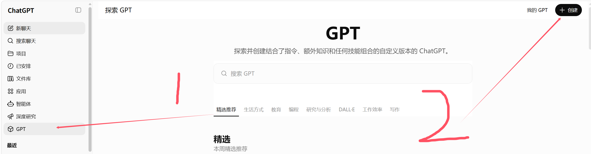
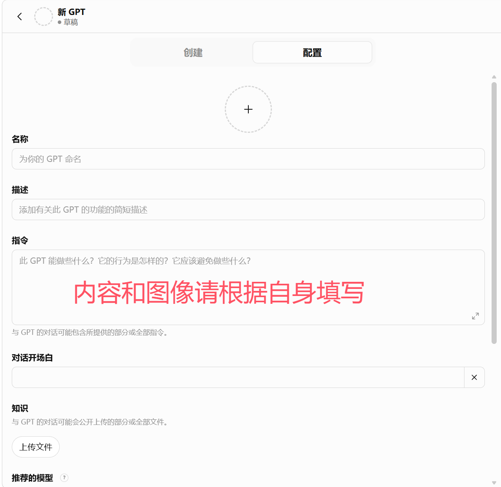
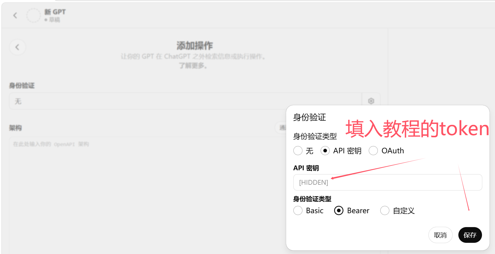
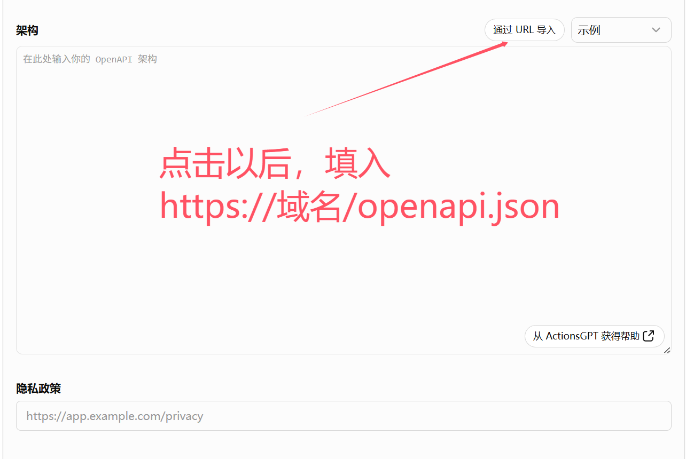

# GPT Actions

[English](GPT_ACTIONS.md) | [简体中文](GPT_ACTIONS.zh-CN.md)

如果 client 支持 remote MCP，使用 MCP。
如果你在构建 Custom GPT，使用 GPT Actions。
两者调用同一个 WebCodex ToolRuntime。

GPT Actions 给 Custom GPT 提供一个聚焦的 WebCodex runtime OpenAPI surface。当你要构建 ChatGPT Custom GPT，而不是通用 remote MCP connector 时，选择这条路径。

## Schema URL

```text
https://your-domain.example/openapi.json
```

本地检查：

```text
http://127.0.0.1:8080/openapi.json
```

真正用于 ChatGPT Actions 时，需要公网 HTTPS URL。

## 在 ChatGPT 中创建 GPT Action

`docs/assets/gpt-action-*.png` 截图是 UI 路标。ChatGPT 可能移动按钮，但流程相同。

1. **打开或创建 GPT。**

   

2. **进入 GPT 配置页面。**

   

3. **打开 Actions 并添加 Action。**

   

4. **配置 Action authentication。**

   

   选择 API-key 或 HTTP authentication，把 auth type 设为 Bearer，并粘贴第一次评估用的 shared key。在 shared-key quick-start 模式下，这个值会通过 hash 标识和 agent key 相同的轻量 group。不要使用 bootstrap/admin、account 或 agent tokens。

5. **导入 OpenAPI schema。**

   

   从你的 WebCodex server 导入 schema URL。如果 ChatGPT 要求 privacy policy URL，填写你自己的产品或部署 policy URL，不要在其中放 secrets。

6. 保存 Action。
7. 先测试 `getRuntimeStatus`，再测试 `listProjects`，最后测试只读 project call。
8. 只读任务能干净结束后，再使用 mutation tools。

## 认证

GPT Actions 使用 Bearer/API-key authentication。

第一次评估时，使用和 `webcodex-cli connect --key` 相同的长随机 Bearer 值。在 shared-key quick-start 模式下，这个值不会被预先登记；它会通过 hash 标识一个轻量 shared-key group。agent 和客户端必须使用同一个值。生产环境使用 scoped user tokens 或 OAuth。完整 credential model 见 [AUTH_MODEL.zh-CN.md](AUTH_MODEL.zh-CN.md)。

不要把 bootstrap/admin、account 或 agent tokens 粘贴进 GPT Actions。

pairing、token creation、agent enrollment、server setup 和其他管理任务属于 `webcodex-cli`，不属于 GPT Actions。

## 工具面

GPT Actions 暴露聚焦的 public operation surface，并通过 generic `callRuntimeTool` 调用 runtime tools。它有意不暴露 admin、setup、pairing、token-management、agent-token、server-management 或 audit endpoints。

使用 `callRuntimeTool` 时，传入 runtime tool name，以及 OpenAPI schema 期望的 flattened top-level fields。使用 focused discovery，不要把完整工具目录塞进模型 prompt。

MCP 和 GPT Actions 共享同一个 runtime、project ids、session recording、agent bridge 和 safety boundaries。

进入陌生项目时，在 `listProjects` 之后通过 `callRuntimeTool` 调用
`project_overview`。它只返回有界结构和项目相对路径元数据，不读取内容，也不
执行 semantic/LSP analysis；之后仍使用 `read_file` 查看具体 README、规则、
manifest 或源码路径。

## 默认 Coding Loop

Custom GPT coding task 使用这个 loop：

```text
startup:
  start_coding_task

inspect:
  project_overview
  list_project_files
  search_project_text
  read_file

edit:
  apply_text_edits          # 规范：带逐文件 SHA-256 的事务式 edit/create/delete/rename
  apply_patch_checked       # 复杂 checked unified diff
  write_project_file        # 仅有意整文件重写
  # 兼容（仍支持）：replace_line_range, insert_at_line,
  # delete_line_range, replace_in_file, replace_exact_block,
  # insert_before_pattern, insert_after_pattern, 裸 apply_patch

validate:
  validate_patch
  cargo_check
  cargo_test
  cargo_fmt
  validation_summary

review:
  show_changes
  git_diff_hunks
  workspace_hygiene_check

finish:
  finish_coding_task
  session_handoff_summary
```

期望的收口顺序：

```text
start_coding_task -> inspect -> edit -> validate -> show_changes -> workspace_hygiene_check -> finish_coding_task
```

需要另一个 operator 或 client 接手时，使用 `session_handoff_summary`。

通过 generic `callRuntimeTool` 调用只读 `validation_summary`，使用 flattened `project`、`session_id` 和可选 `limit`。它没有 dedicated GPT Action operation，因此 focused surface 仍为 25 operations，而 runtime catalog 为 75 tools。它只查询 session ledger 中已有的 bounded parser-v3 evidence，不会重新运行 Cargo、shell、agent work 或读取文件。Diagnostics 与 failed-test details 都有固定边界并经过 sanitization，不返回完整 stdout/stderr，也不进行 root-cause inference。可在两次 validation 之间用它指导 targeted fix，最后仍用 `finish_coding_task` 得到规范的 closeout outcomes。

## Advanced / Escape-Hatch Tools

```text
run_shell:
  bounded escape hatch, not default editing or validation path

run_job:
  for explicit async jobs, not default coding loop

artifact / checkpoint / cleanup:
  advanced workflow tools
```

shell 和 job tools 可以通过 agent 执行项目命令。只有结构化 validation helper 不够时才使用，并在 finish 前 review workspace state。

artifact、checkpoint 和 cleanup tools 支持 advanced workflow。它们不是结构化源码编辑或常规 code review 的替代品。

## 第一个安全 Prompt

```text
Use WebCodex on project agent:<client_id>:<project_id>.
Start a coding task, inspect README.md, summarize the project, show changes
without a diff, run workspace hygiene, and finish. Do not edit files.
```

这一步成功后，再在 disposable branch 上尝试一个小而可回滚的修改。

## 常见错误

### Schema Import Fails

确认 server 可通过公网 HTTPS 访问，并且 `/openapi.json` 返回 WebCodex schema。

### Auth Fails

确认 Action 使用 Bearer/API-key auth，且 token 是用于 GPT Actions 或 runtime access 的凭据。

### GPT Chose The Wrong Project

在 prompt 中写完整 `agent:<client_id>:<project_id>`。让 GPT 在读取或编辑前先调用 `listProjects` 或 `list_projects`。

### Response Too Large

使用 compact runtime status、focused tool manifest discovery、有界 file reads、`show_changes(include_diff=false)`，以及 summary-only finish 或 handoff outputs。

### Shell Is Suggested Too Early

把 GPT 拉回默认 loop：inspect、structured edit、structured validation、review 和 finish。shell/job 只作为显式 escape hatch。

## 相关文档

- 快速开始：[QUICK_START.zh-CN.md](QUICK_START.zh-CN.md)
- Demo 工作流：[DEMO.zh-CN.md](DEMO.zh-CN.md)
- MCP：[MCP.zh-CN.md](MCP.zh-CN.md)
- 概念：[CONCEPTS.zh-CN.md](CONCEPTS.zh-CN.md)
- 认证模型：[AUTH_MODEL.zh-CN.md](AUTH_MODEL.zh-CN.md)
- 安全：[../SECURITY.md](../SECURITY.md)
