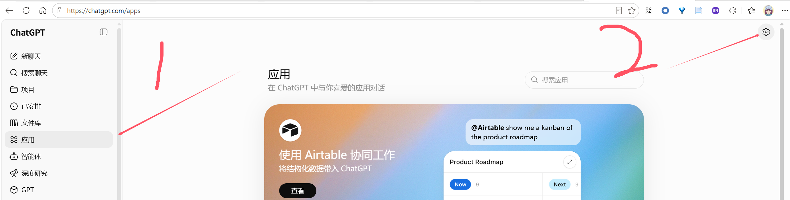
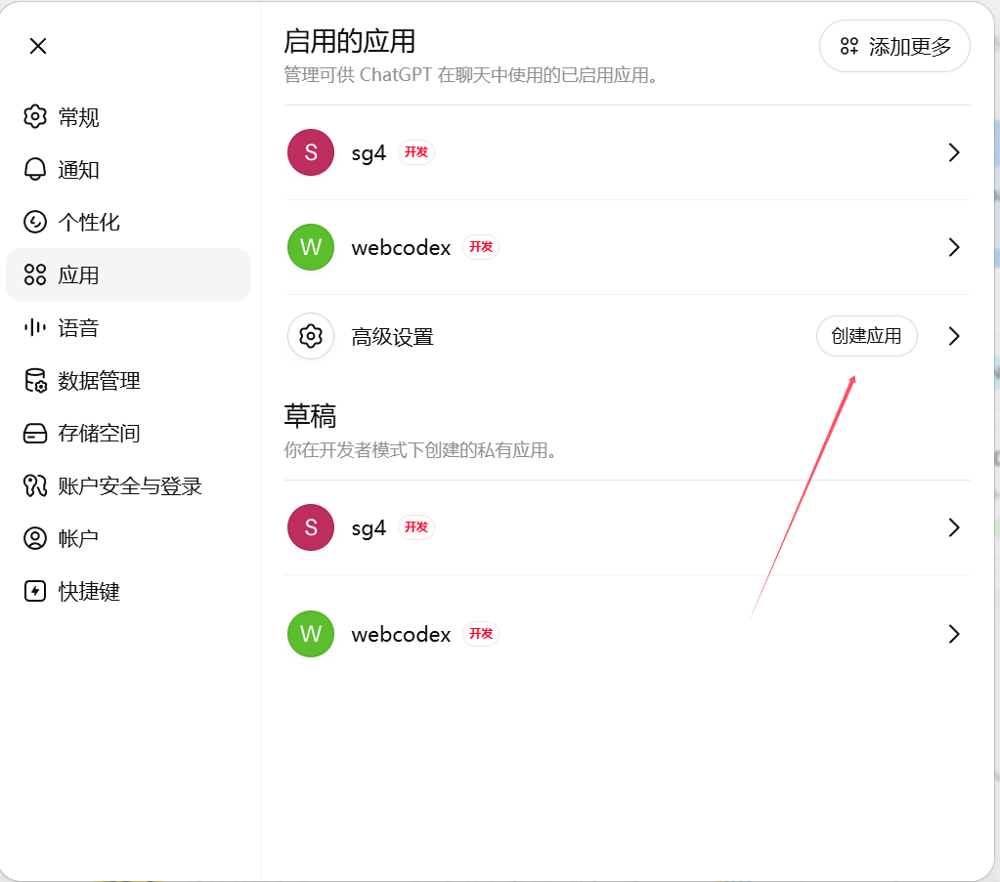
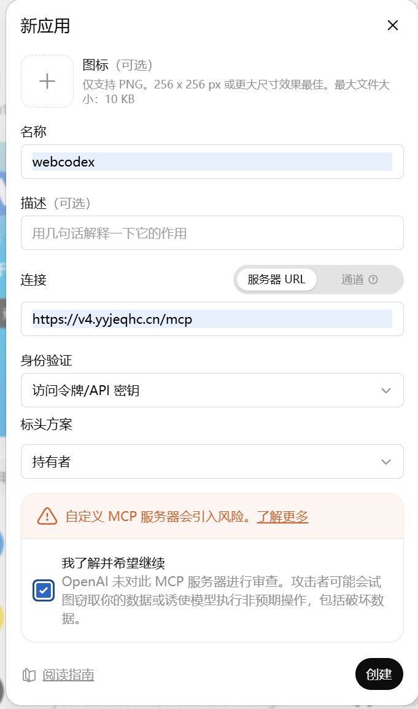
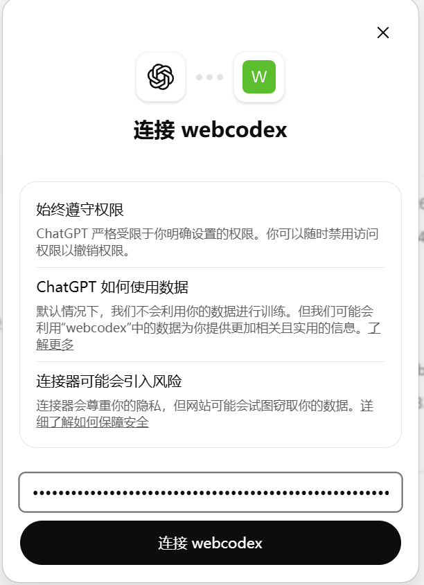

# MCP

[English](MCP.md) | [简体中文](MCP.zh-CN.md)

Use MCP if your client supports remote MCP.
Use GPT Actions if you are building a Custom GPT.
Both surfaces call the same WebCodex ToolRuntime.

WebCodex acts as the remote MCP server. The WebCodex agent is not the MCP client; it is the local execution worker behind the WebCodex server.

## Endpoint

```text
https://your-domain.example/mcp
```

For a local smoke test:

```text
http://127.0.0.1:8080/mcp
```

Hosted clients usually require HTTPS. Use your own WebCodex domain in place of `your-domain.example`.

## Authentication

Configure the MCP client with Bearer/API-key authentication:

```text
Authorization: Bearer <shared key>
```

For the first evaluation, use the same long random Bearer value that you used with `webcodex-cli connect --key`. In shared-key quick-start mode, this value is not pre-enrolled; it identifies a lightweight shared-key group by hash. Use the same value for the agent and the client. Do not use bootstrap/admin, account, or agent tokens for MCP.

For production, use scoped user tokens or OAuth. See [AUTH_MODEL.md](AUTH_MODEL.md) for the full credential model.

Do not paste real tokens into committed MCP config files. Prefer environment variables or your client secret store.

## Create A ChatGPT MCP App / Connector

The screenshots in `docs/assets/mcp-*.png` are UI landmarks for the ChatGPT app/connector flow:






1. Open ChatGPT apps/connectors and create or configure an MCP app.
2. Name it something recognizable, for example `webcodex`.
3. Set the MCP server URL to your WebCodex `/mcp` endpoint.
4. Configure HTTP/API-key Bearer authentication.
5. Save and connect the app.
6. Start with discovery and read-only project calls before any write task.

## First Checks

Ask the client to run low-risk checks:

1. `runtime_status` with a compact or summary shape.
2. `list_projects`.
3. `project_overview` for a bounded, structured view of an unfamiliar project.
4. A bounded `read_file` call against a key path returned by the overview.
5. `show_changes` with `include_diff=false`.

The project id should look like:

```text
agent:<client_id>:<project_id>
```

Name the full project id in prompts so the model does not choose the wrong repository.

## Default Coding Loop

Use this workflow rather than asking the model to improvise a shell session:

```text
startup:
  start_coding_task

inspect:
  project_overview
  list_project_files
  search_project_text
  read_file

edit:
  replace_line_range
  insert_at_line
  delete_line_range
  apply_text_edits
  apply_patch_checked

validate:
  validate_patch
  cargo_check
  cargo_test
  cargo_fmt

review:
  show_changes
  git_diff_hunks
  workspace_hygiene_check

finish:
  finish_coding_task
  session_handoff_summary
```

`project_overview` returns only deterministic structure and project-relative
path metadata. It does not read file contents or perform semantic/LSP analysis;
use `read_file` afterward to inspect README, rules, manifests, or source.

`start_coding_task` returns the session id used by later review and finish tools. `finish_coding_task` is the preferred closeout for a completed task; `session_handoff_summary` is for passing context to another operator or later client.

## Read-Only LSP Navigation

Current LSP tools are:

- `lsp_status`
- `document_symbols`
- `document_diagnostics`
- `hover`
- `workspace_symbols`
- `goto_definition`
- `find_references`

The current MVP supports Rust only. These tools are read-only, operate only within the
registered workspace, and do not navigate dependencies. They do not expose
client-controlled document synchronization or any write operation. Validated
open `.rs` files refresh from current disk content with full-text sync only.
`document_diagnostics` uses bounded rust-analyzer publications and returns
explicit `fresh` / `timed_out` state; it is fast semantic feedback, not Cargo
check. Under the constrained profile, no diagnostic publication may arrive;
that is a successful empty or stale result with `fresh=false` and
`timed_out=true`. Availability depends on the selected agent advertising
`lsp_read_only_navigation`.

When `start_coding_task.semantic_navigation.recommended=true`, use:

```text
start_coding_task
→ document_symbols / workspace_symbols
→ goto_definition / find_references / hover
→ read_file
→ edit
→ document_diagnostics
→ cargo_check / cargo_test
```

Use `workspace_symbols` as a bounded fallback when the relevant source file is
not yet known; it does not replace the more focused `document_symbols` flow.
All symbol and hover locations are workspace-filtered. Dependency navigation
remains unsupported. `document_diagnostics` never substitutes for final Cargo
validation.

When semantic navigation is unavailable, use:

```text
project_overview
→ search_project_text
→ read_file
```

## Advanced And Escape-Hatch Tools

```text
run_shell:
  bounded escape hatch, not default editing or validation path

run_job:
  for explicit async jobs, not default coding loop

artifact / checkpoint / cleanup:
  advanced workflow tools
```

These tools are useful, but they are not the first thing a model should reach for. Prefer structured read, edit, validation, review, and finish tools.

## Tool Discovery

MCP can expose runtime tools directly. Do not put the entire tool catalog into every prompt. For daily discovery, ask for a compact manifest or focused category, then use the default coding loop above.

Use full schema-oriented discovery only when debugging client/tool schema behavior.

## Example Client Configuration

The exact shape depends on your MCP client:

```json
{
  "mcpServers": {
    "webcodex": {
      "url": "https://your-domain.example/mcp",
      "headers": {
        "Authorization": "Bearer ${WEBCODEX_MCP_BEARER}"
      }
    }
  }
}
```

Use `WEBCODEX_MCP_BEARER` for the Bearer value configured in your MCP client.
It may be the quick-start shared key or a production user token. It must not be
the server bootstrap `WEBCODEX_TOKEN`, an account credential, or an agent token.

## Common Errors

### 401 Unauthorized

The token is missing, malformed, expired, revoked, or not recognized. Confirm the MCP client is sending the intended Bearer value.

### 403 Forbidden

The token is valid but lacks the scope needed for the requested tool or project operation. Use a token intended for runtime/project/job access.

### Agent Offline

The server is reachable, but the selected agent is not connected. Start `webcodex-agent` and check `runtime_status`.

### Project Not Registered

The agent is online, but the requested `agent:<client_id>:<project_id>` does not exist. Register the project through the agent connection flow and retry `list_projects`.

### Response Too Large

Use compact runtime status, focused manifest discovery, bounded file ranges, `show_changes(include_diff=false)`, and summary-only finish or handoff calls.

## Related Docs

- Quick Start: [QUICK_START.md](QUICK_START.md)
- Demo workflow: [DEMO.md](DEMO.md)
- GPT Actions: [GPT_ACTIONS.md](GPT_ACTIONS.md)
- Auth model: [AUTH_MODEL.md](AUTH_MODEL.md)
- Security: [../SECURITY.md](../SECURITY.md)
