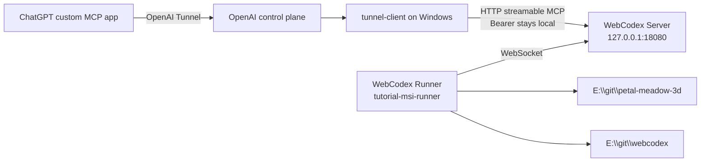
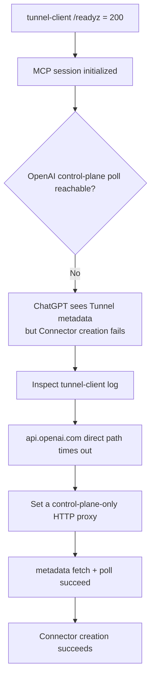

# Windows + OpenAI Secure MCP Tunnel: End-to-End Guide

[English](WINDOWS_OPENAI_TUNNEL.md) | [简体中文](WINDOWS_OPENAI_TUNNEL.zh-CN.md)

> This guide records a real dogfood run performed on 2026-08-30. We started an independent WebCodex Server and Runner on Windows, connected that Server through OpenAI `tunnel-client`, created a ChatGPT Tunnel Connector, registered local repositories through that Connector, and then used the same tunnel path to create this documentation branch. It also records the network failure encountered during the first attempt.

## When to use this topology

Use this setup when the Windows machine should host the complete WebCodex runtime while keeping the Server private:

- WebCodex Server runs in the foreground on Windows;
- an independent WebCodex Runner connects to that Server;
- the Server stays loopback-only and exposes no public WebCodex port;
- ChatGPT reaches `/mcp` through an OpenAI Secure MCP Tunnel;
- the Runner can register and operate multiple local repositories exactly like a normal Runner connected to a hosted Server.

For a temporary one-repository share, prefer the simpler product path:

```powershell
webcodex share --tunnel openai
```

This document focuses on the lower-level independent Server + independent Runner topology for dogfood, validation, and explicit lifecycle control on Windows.

## Architecture



Two boundaries matter:

1. ChatGPT selects **Connection: Tunnel** and never needs the local WebCodex Bearer.
2. The Runner remains a standard WebCodex Runner. The Tunnel changes only the private ChatGPT-to-MCP transport; it does not change the Runner protocol.

## 1. Prerequisites

### WebCodex

Install a current WebCodex build and make sure the CLI, Server, and Runner binaries come from the same version/commit:

```powershell
webcodex --version
webcodex-server --version
webcodex-runner --version
```

The dogfood recorded here used:

```text
WebCodex 0.3.9
commit 1fa862829122
```

Do not debug a transport problem with a mixed CLI/Server/Runner baseline. At the start of this run, the Windows machine had mismatched installed binaries, so we first aligned all three to the same build.

### OpenAI Secure MCP Tunnel

Create or select an OpenAI Secure MCP Tunnel and configure these variables in the Windows user environment:

```text
CONTROL_PLANE_TUNNEL_ID
CONTROL_PLANE_API_KEY
```

Use a Restricted `CONTROL_PLANE_API_KEY` with only Tunnels **Read + Use** when possible.

Never print or commit the Tunnel ID, API key, WebCodex Bearer, bootstrap token, or authorization-file contents.

WebCodex uses a pinned and verified OpenAI `tunnel-client`; the implementation can also resolve it from `WEBCODEX_TUNNEL_CLIENT_BIN` or `PATH`.

## 2. Initialize a Windows foreground Server

Use dedicated env/data paths so this test does not overwrite an existing WebCodex runtime:

```powershell
$envFile = Join-Path $HOME ".config\webcodex\tutorial-selfhost\webcodex.env"
$dataDir = Join-Path $HOME ".local\share\webcodex-tutorial-selfhost"

webcodex server init `
  --listen 127.0.0.1:18080 `
  --data-dir $dataDir `
  --env-file $envFile `
  --json
```

`server init` creates the Server bootstrap/admin credential in the private env file. That credential is not an MCP or Runner credential.

Keep one PowerShell terminal open for the Server:

```powershell
webcodex server run --env-file $envFile
```

Expected evidence includes:

```text
Listening on: 127.0.0.1:18080
MCP endpoint: http://localhost:18080/mcp
Agent WebSocket: http://localhost:18080/api/agents/ws
```

Windows currently supports the foreground Server runtime. Closing the terminal or pressing Ctrl-C ends the Server.

## 3. Pair, log in, and start an independent Runner

Open a second PowerShell terminal and create a short-lived pairing code on the Server side:

```powershell
webcodex pairing create `
  --server-url http://127.0.0.1:18080 `
  --env-file $envFile `
  --username tutorial `
  --display-name "Tutorial Windows Runner" `
  --ttl-secs 600
```

Redeem the code on the Runner side. Restrict the allowed root to the real parent directory of the repositories when practical:

```powershell
webcodex login http://127.0.0.1:18080 `
  --code <wc_pair_...> `
  --allowed-root E:\git `
  --json
```

`login --json` reports an `agent_config` path without requiring the resulting credential to be pasted into ChatGPT. Start the Runner with that config:

```powershell
webcodex runner run --config <login-reported-agent-config>
```

The Runner in this dogfood registered as:

```text
client_id=tutorial-msi-runner
preferred_transport=websocket
actual_transport=websocket
projects=0
```

At this point the Server sees a normal independent Runner with zero registered projects.

## 4. Validate local MCP before exposing it through the Tunnel

The `tunnel-client` MCP target is the loopback endpoint:

```text
http://127.0.0.1:18080/mcp
```

Keep the WebCodex Bearer local and inject it through a file-backed `Authorization` header. Do not paste that Bearer into ChatGPT.

Before starting the long-lived daemon, run `tunnel-client doctor`. In this dogfood, `doctor` validated the Tunnel ID, Restricted control-plane API key, local WebCodex MCP reachability, and local Bearer injection together.

The runtime arguments are conceptually:

```text
--mcp.server-url url=http://127.0.0.1:18080/mcp,channel=main
--mcp.extra-headers Authorization: file:<private-authorization-file>
--health.listen-addr 127.0.0.1:0
--health.url-file <private-health-url-file>
```

`webcodex share --tunnel openai` automates the same categories of setup, runs `doctor`, and waits for `/readyz`. Manual operation is intended for an explicit independent Server/Runner topology or deep troubleshooting.

## 5. Real Windows + Clash failure: local readiness was green, but Connector creation failed

On the first attempt, the local Tunnel looked healthy:

- the WebCodex MCP session initialized successfully;
- `/readyz` returned HTTP 200;
- `tunnel-client` was running.

ChatGPT still failed to create the Connector with only:

```text
Something went wrong.
```

The actual failure was not the local MCP hop. It was the **OpenAI control-plane long poll**.

The Tunnel log repeatedly showed the equivalent of:

```text
poll failed; backing off
Get "https://api.openai.com/v1/tunnels/<redacted>/poll...":
connectex: A connection attempt failed
```

The Windows host had this networking shape:

- interactive browser traffic normally used Clash;
- `HTTP_PROXY` / `HTTPS_PROXY` were not exported to the process environment;
- Windows system proxy was not enabled;
- the direct DNS/IPv6 path used by `api.openai.com` was unreachable from this process.

That produced a misleading split state:



### Fix

Verify the host's HTTP proxy first. In this run, Clash listened on:

```text
http://127.0.0.1:7890
```

After confirming that the proxy could reach `api.openai.com`, route only the OpenAI control plane through it:

```text
--control-plane.http-proxy http://127.0.0.1:7890
```

The corrected Tunnel log reported:

```text
route_kind=control_plane
route_mode=proxy
proxy_source=control-plane.http-proxy
proxy_url=http://127.0.0.1:7890
```

and then:

```text
tunnel metadata fetched
name=webcodex
description=for mcp use
recent_controlplane_failures=0
```

Connector creation succeeded immediately after that.

> A working browser does not prove that `tunnel-client` can directly reach the OpenAI control plane. On Windows hosts that depend on Clash, another proxy, split DNS, or special IPv6 routing, validate both local MCP readiness and control-plane metadata/poll health. `/readyz` alone is not sufficient end-to-end evidence.

## 6. Create the ChatGPT Connector

In ChatGPT Developer Mode, create a custom MCP app and use:

1. any name, such as `tunnel-test`;
2. **Connection: Tunnel**;
3. the selected WebCodex OpenAI Tunnel;
4. **Authentication: No authentication**;
5. acknowledge the custom MCP risk notice;
6. create/scan the app tools.

Why **No authentication**? The WebCodex Bearer for the local MCP hop is already injected locally by `tunnel-client`. ChatGPT should not receive or store it.

Refresh the ChatGPT window after creating the app if the new tool namespace does not appear in the current conversation.

## 7. End-to-end validation through the new Connector

After the Connector was created, the rest of this dogfood used the new `tunnel-test` app instead of the pre-existing hosted WebCodex connector:

```text
ChatGPT
  -> tunnel-test
  -> OpenAI Secure MCP Tunnel
  -> Windows WebCodex Server
  -> tutorial-msi-runner
  -> local project
```

The first `list_projects` returned:

```text
count=0
```

We then registered the real path:

```text
E:\git\petal-meadow-3d
```

The registration returned an online, connected Runner-backed project with a clean `main` workspace. That proved the Connector could do more than complete UI setup: it could reach the independent Windows Runner and register a real local workspace.

We then used the **same Connector** to register:

```text
E:\git\webcodex
```

and created the documentation branch:

```text
docs/windows-openai-tunnel-guide
```

This guide itself was therefore created through the Windows Server + independent Runner + OpenAI Tunnel path that it documents.

## 8. Acceptance checklist

Do not treat “the process started” as completion. Validate every layer that matters:

| Layer | Evidence |
| --- | --- |
| Windows Server | loopback listener is active and `/mcp` is reachable |
| Runner | Runner is online and `actual_transport=websocket` |
| Local MCP | `tunnel-client` reports `mcp session initialized` |
| Tunnel health | `/readyz = 200` |
| OpenAI control plane | metadata fetch succeeds and polling does not continuously fail |
| ChatGPT | Connector is created and its tools load |
| Project | the Connector can register a real Runner-owned path |
| Read | files can be read through the new Connector |
| Write | a dedicated branch can be modified and reviewed with Git diff |

The last project/read/write checks are what prove parity with the normal hosted Server + Runner development experience.

## 9. Common mistakes

### Treating `/readyz = 200` as full Tunnel readiness

Do not. This dogfood had local health and MCP readiness while the OpenAI control-plane poll was failing.

### Pasting the WebCodex Bearer into ChatGPT

Do not. OpenAI Secure MCP Tunnel mode uses **No authentication** in ChatGPT; the Bearer stays local.

### Assuming Windows requires WSL or a Windows Service

It does not. Foreground Server and Runner operation is supported. The tradeoff is lifecycle: closing the terminals stops the processes, and managed Windows service lifecycle is not currently provided.

### Assuming `share --tunnel openai` is unrelated to this topology

The core transport is the same: local WebCodex MCP, local Bearer injection, and OpenAI `tunnel-client`. `share` owns a temporary Server/Runner/session automatically; this guide keeps the Server and Runner explicit so they can behave like a normal long-lived topology and be diagnosed independently.

## 10. Dogfood conclusion

The following combination has now been exercised end to end on Windows:

```text
Windows foreground WebCodex Server
+ independent WebCodex Runner over WebSocket
+ OpenAI Secure MCP Tunnel
+ ChatGPT Tunnel Connector
+ model-driven project registration and repository writes
```

It provides the core development workflow of a hosted WebCodex Server + normal Runner without exposing the WebCodex Server directly to the Internet.

The main failure found in this run was not Runner execution. It was the `tunnel-client` route to the OpenAI control plane in a Windows proxy environment. When a Tunnel appears locally ready but ChatGPT Connector creation fails, inspect metadata/poll status and configure an explicit control-plane HTTP proxy when required.

## Related documentation

- [Deployment](DEPLOYMENT.md)
- [MCP](MCP.md)
- [CLI](CLI.md)
- [Troubleshooting](TROUBLESHOOTING.md)
