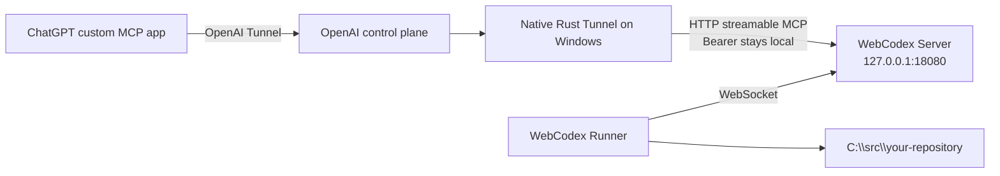

# Windows + OpenAI Secure MCP Tunnel: End-to-End Guide

[English](WINDOWS_OPENAI_TUNNEL.md) | [简体中文](WINDOWS_OPENAI_TUNNEL.zh-CN.md)

This page is the current deep-dive guide for running an independent foreground WebCodex Server and Runner on Windows behind an OpenAI Secure MCP Tunnel. The stable setup and troubleshooting steps come first. A clearly separated [historical dogfood note](#historical-dogfood-note--2026-08-30) at the end preserves the real 2026-08-30 validation evidence without making that old version, machine, repository, or app name part of the current setup contract.

## When to use this topology

If your goal is simply **normal long-lived WebCodex use**, start with the [Full Setup guide](PERSONAL_SETUP.md). This page is a Windows + OpenAI Tunnel deep dive and troubleshooting record; continue here when you deliberately choose this private network path, need to reproduce the explicit topology, or are diagnosing Tunnel behavior.

Use this setup when the Windows machine should host the complete WebCodex runtime while keeping the Server private:

- WebCodex Server runs in the foreground on Windows;
- an independent WebCodex Runner connects to that Server;
- the Server stays loopback-only and exposes no public WebCodex port;
- ChatGPT reaches `/mcp` through an OpenAI Secure MCP Tunnel;
- the Runner can register and operate multiple local repositories exactly like a normal Runner connected to a hosted Server.

For a temporary one-repository share, prefer the simpler product path:

```powershell
webcodex share --tunnel openai
```

This document focuses on the lower-level independent Server + independent Runner topology for explicit lifecycle control and Tunnel troubleshooting on Windows.

## Architecture


```mermaid
flowchart LR
    C[ChatGPT custom MCP app] -->|OpenAI Tunnel| CP[OpenAI control plane]
    CP --> TC[Native Rust Tunnel on Windows]
    TC -->|HTTP streamable MCP\nBearer stays local| S[WebCodex Server\n127.0.0.1:18080]
    R[WebCodex Runner] -->|WebSocket| S
    R --> P[C:\\src\\your-repository]
```

Two boundaries matter:

1. ChatGPT selects **Connection: Tunnel** and never needs the local WebCodex Bearer.
2. The Runner remains a standard WebCodex Runner. The Tunnel changes only the private ChatGPT-to-MCP transport; it does not change how the Runner connects to or operates projects through WebCodex.

## 1. Prerequisites

### WebCodex

Install the current WebCodex build and make sure the CLI, Server, and Runner binaries come from the same version/commit:

```powershell
webcodex --version
webcodex-server --version
webcodex-runner --version
```

Do not debug a transport problem with a mixed CLI/Server/Runner baseline. Align all three binaries first. The exact build used by the historical 2026-08-30 validation is recorded only in the historical section below.

### OpenAI Secure MCP Tunnel

Create or select an OpenAI Secure MCP Tunnel and configure these variables in the Windows user environment:

```text
CONTROL_PLANE_TUNNEL_ID
CONTROL_PLANE_API_KEY
```

Use a Restricted `CONTROL_PLANE_API_KEY` with only Tunnels **Read + Use** when possible.

Never print or commit the Tunnel ID, API key, WebCodex Bearer, bootstrap token, or authorization-file contents.

WebCodex embeds its native Rust Tunnel client; no separate tunnel-client installation is required.

## 2. Initialize a Windows foreground Server

Use dedicated env/data paths so this topology does not overwrite another WebCodex runtime:

```powershell
$envFile = Join-Path $HOME ".config\webcodex\openai-tunnel\webcodex.env"
$dataDir = Join-Path $HOME ".local\share\webcodex-openai-tunnel"

webcodex server init `
  --listen 127.0.0.1:18080 `
  --data-dir $dataDir `
  --env-file $envFile `
  --json
```

`server init` creates the Server bootstrap/admin credential in the private env file. That credential is not an MCP or Runner credential.

Keep one PowerShell terminal open for the Server:

```powershell
webcodex server run --env-file $envFile
```

Confirm that the Server is listening on loopback and exposes the local MCP endpoint:

```text
Listening on: 127.0.0.1:18080
MCP endpoint: http://localhost:18080/mcp
```

Windows currently supports the foreground Server runtime. Closing the terminal or pressing Ctrl-C ends the Server.

## 3. Pair, log in, and start an independent Runner

Open a second PowerShell terminal and create a short-lived pairing code on the Server side:

```powershell
webcodex pairing create `
  --server-url http://127.0.0.1:18080 `
  --env-file $envFile `
  --username windows-user `
  --display-name "Windows Runner" `
  --ttl-secs 600
```

Redeem the code on the Runner side. Register the repository you want to use through the Connector now, and restrict the allowed root to its real parent directory when practical:

```powershell
webcodex login http://127.0.0.1:18080 `
  --code <wc_pair_...> `
  --allowed-root C:\src `
  --project C:\src\your-repository `
  --json
```

`login --json` reports a `runner_config` path without requiring the resulting credential to be pasted into ChatGPT. Start the Runner with that config:

```powershell
webcodex runner run --config <login-reported-runner-config>
```

Check the returned config with `webcodex runner status --config <login-reported-runner-config>`. At this point the Server should see a normal independent Runner with `C:\src\your-repository` already registered. Add more projects later with the normal `webcodex project register --config ...` workflow when needed.

## 4. Start the native Tunnel

Use `webcodex server tunnel --provider openai --env-file <server-env-file>` for
an existing local Server, or `webcodex share --tunnel openai` for a temporary
Server/Runner. The native Rust client verifies local authenticated `/mcp` and a
successful control-plane poll before readiness. Local Bearer injection stays in
memory. There is no separate binary download, doctor child, or `/readyz` port.

## 5. Diagnose the two connection hops

Desktop and `--json` health events expose `tunnel_ready` and `local_mcp_ready`
separately. Neither proves real ChatGPT connector creation. Check local Server
health, Restricted Tunnel credentials, and the control-plane network route.
Desktop proxy settings apply to the control plane; local MCP bypasses proxies.
For CLI use, configure standard `HTTPS_PROXY`/`NO_PROXY` environment settings.
Redirects never change the endpoint or credential audience.

An uncertain previous run blocks restart. Resolve earlier effects and pending
requests before clearing its private `webcodex/tunnel-runs` marker, or use a new
Tunnel identity. See the [native client contract](../crates/webcodex-openai-tunnel/README.md).

## 6. Create the ChatGPT Connector

In ChatGPT Developer Mode, create a custom MCP app and use:

1. any descriptive name, such as `WebCodex Windows`;
2. **Connection: Tunnel**;
3. the selected WebCodex OpenAI Tunnel;
4. **Authentication: No authentication**;
5. acknowledge the custom MCP risk notice;
6. create/scan the app tools.

Why **No authentication**? The WebCodex Bearer for the local MCP hop is already injected locally by the native Rust Tunnel client. ChatGPT should not receive or store it.

## 7. Validate end to end through the Connector

After creating the Connector, refresh the ChatGPT window if the new tools do not appear in the current conversation. Then validate the path beyond UI setup:

1. confirm the Project registered during `webcodex login --project ...` is visible;
2. select that registered Project and read a known file through the Connector;
3. if write access is intentionally enabled, use a dedicated branch/safe change and review the resulting Git diff.

The project handle returned by WebCodex is output, not setup input. Do not ask the user to invent a Runner/project runtime id.

## 8. Acceptance checklist

Do not treat “the process started” as completion. Validate every layer that matters:

| Layer | Evidence |
| --- | --- |
| Windows Server | loopback listener is active and `/mcp` is reachable |
| Runner | Runner is online and `actual_transport=websocket` |
| Local MCP | `local_mcp_ready: true` |
| Native Tunnel | `tunnel_ready: true` after a successful control-plane poll |
| OpenAI control plane | polling continues without persistent authentication, network, or protocol failures |
| ChatGPT | Connector is created and its tools load |
| Project | the Project registered during login is visible through the Connector |
| Read | files can be read through the new Connector |
| Write | a dedicated branch can be modified and reviewed with Git diff |

The last project/read/write checks are what prove parity with the normal hosted Server + Runner development experience.

## 9. Common mistakes

### Treating `tunnel_ready: true` as full Connector readiness

Do not. It proves the native client completed a successful control-plane poll, not that ChatGPT created the Connector or loaded its tools. Validate the ChatGPT layer separately.

### Pasting the WebCodex Bearer into ChatGPT

Do not. OpenAI Secure MCP Tunnel mode uses **No authentication** in ChatGPT; the Bearer stays local.

### Assuming Windows requires WSL or a Windows Service

It does not. Foreground Server and Runner operation is supported. The tradeoff is lifecycle: closing the terminals stops the processes, and managed Windows service lifecycle is not currently provided.

### Assuming `share --tunnel openai` is unrelated to this topology

The core transport is the same: local WebCodex MCP, local Bearer injection, and the native Rust Tunnel client. `share` owns a temporary Server/Runner/session automatically; this guide keeps the Server and Runner explicit so they can behave like a normal long-lived topology and be diagnosed independently.

## Historical dogfood note — 2026-08-30

> Historical evidence only. The setup above describes the current supported behavior. This documentation cleanup did **not** rerun the 2026-08-30 Windows experiment on the current 0.4 branch, so the exact version, commit, paths, app name, and branch below must not be treated as current requirements.

The real run used:

```text
WebCodex 0.3.9
commit 1fa862829122
Runner client_id=tutorial-msi-runner
preferred/actual transport=websocket
ChatGPT app=tunnel-test
```

The independent Runner began with zero projects, then the Tunnel Connector registered and accessed these real Windows repositories:

```text
E:\git\petal-meadow-3d
E:\git\webcodex
```

The same Connector was used to create the documentation branch:

```text
docs/windows-openai-tunnel-guide
```

That run therefore demonstrated the complete path from ChatGPT through OpenAI Tunnel to a foreground Windows Server, an independent WebSocket Runner, real project registration, repository reads, and repository writes.

The first Connector-creation attempt also established an important network failure mode. Local MCP initialization and `/readyz = 200` were healthy, while the OpenAI control-plane poll failed because the Windows process did not inherit the browser's Clash route and its direct DNS/IPv6 path to `api.openai.com` was unusable. The tested Clash HTTP proxy listened on:

```text
http://127.0.0.1:7890
```

Routing only the control plane through that proxy:

```text
--control-plane.http-proxy http://127.0.0.1:7890
```

changed the Tunnel log to a healthy proxy route and successful metadata/poll state; Connector creation then succeeded. Those `/readyz`, metadata, and external `tunnel-client` details describe the retired implementation. The current native client preserves the underlying troubleshooting rule: browser or local MCP reachability does not prove that the control-plane poll is healthy.

## Related documentation

- [Deployment](DEPLOYMENT.md)
- [MCP](MCP.md)
- [CLI](CLI.md)
- [Troubleshooting](TROUBLESHOOTING.md)
