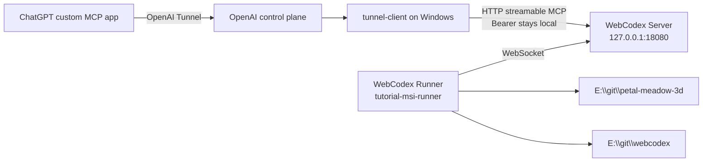
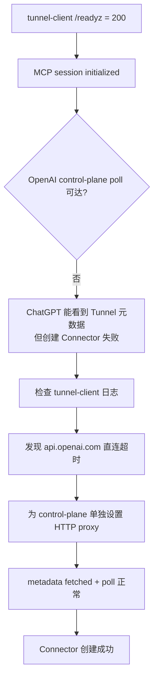
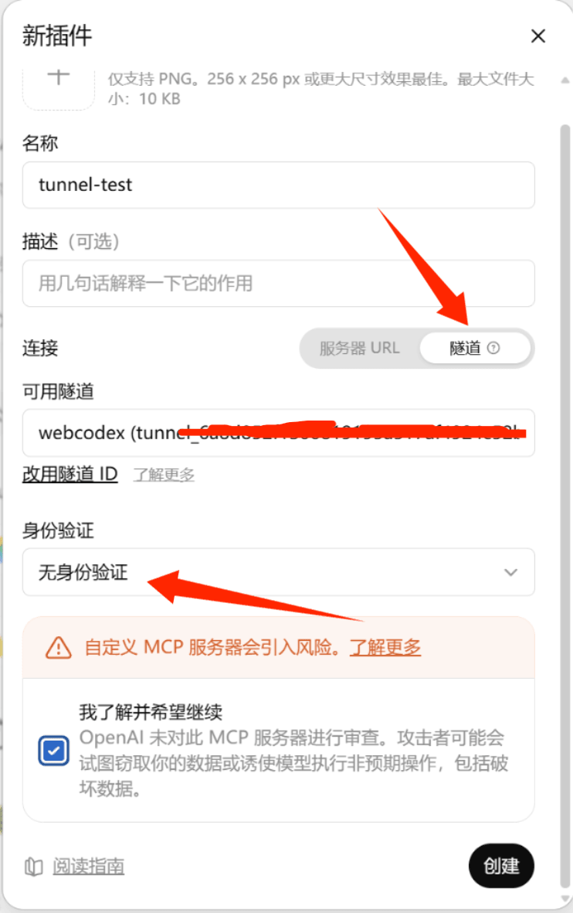
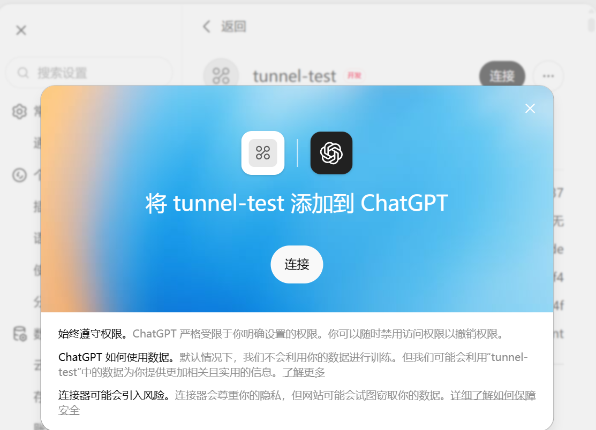
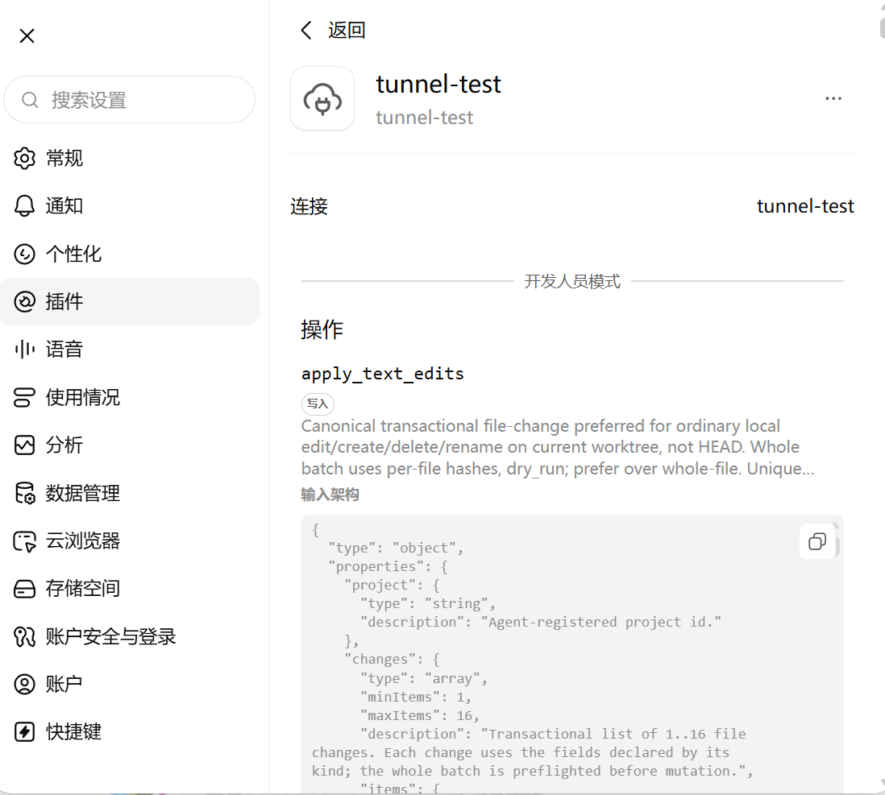

# Windows + OpenAI Secure MCP Tunnel 实操指南

[English](WINDOWS_OPENAI_TUNNEL.md) | [简体中文](WINDOWS_OPENAI_TUNNEL.zh-CN.md)

> 本文不是只按设计文档整理出来的“理论步骤”。2026-08-30，我们在一台 Windows 机器上从零启动独立 WebCodex Server、独立 Runner 和 OpenAI `tunnel-client`，在 ChatGPT Developer Mode 新建 Tunnel Connector，并最终通过这个 Connector 注册并访问本机项目。本文记录的是这次真实跑通的流程，以及过程中实际遇到的一次网络故障。

## 适用场景

如果你的目标只是**正常长期使用 WebCodex**，先看[完整使用指南](PERSONAL_SETUP.zh-CN.md)。本文是 Windows + OpenAI Tunnel 的深入配置与故障排查记录，只有在你明确选择这条私有网络入口、需要复现实操拓扑或排查 Tunnel 问题时才需要继续阅读。

你希望 Windows 机器本身承担完整的 WebCodex runtime：

- WebCodex Server 运行在 Windows 前台；
- WebCodex Runner 作为独立 Runner 连接这个 Server；
- Server 不暴露公网端口；
- ChatGPT 通过 OpenAI Secure MCP Tunnel 访问 Server 的 `/mcp`；
- 后续可以像使用普通公网 Server + 正式 Runner 一样注册多个本机项目并进行读写。

如果只是临时分享一个仓库，优先使用更简单的：

```powershell
webcodex share --tunnel openai
```

本文重点是更底层的“独立 Server + 独立 Runner”拓扑，适合验证、dogfood 或需要显式控制 runtime 生命周期的 Windows 环境。

## 整体结构



这里有两个重要边界：

1. ChatGPT 只选择 **Connection: Tunnel**，不需要拿到 WebCodex 本地 Bearer。
2. Runner 仍然是标准 WebCodex Runner；Tunnel 只解决 ChatGPT 到 MCP Server 的私有传输，不改变 Runner 协议。

## 1. 前置条件

### WebCodex

安装当前 WebCodex，确保三个 Windows binary 来自同一版本/commit：

```powershell
webcodex --version
webcodex-server --version
webcodex-runner --version
```

本次 dogfood 使用的是：

```text
WebCodex 0.3.9
commit 1fa862829122
```

不要把不同版本的 CLI、Server 和 Runner 混在一起排查网络问题；本次开始测试时就发现机器上原有 CLI/Server/Runner 版本并不完全一致，因此先统一了 binary baseline。

### OpenAI Secure MCP Tunnel

## 这个tunnel_id 还有api-key需要问gpt在它的官网手动创建

需要已经创建好的 OpenAI Secure MCP Tunnel，并在 Windows 用户环境中配置：

```text
CONTROL_PLANE_TUNNEL_ID
CONTROL_PLANE_API_KEY
```

`CONTROL_PLANE_API_KEY` 建议使用只授予 Tunnels **Read + Use** 的 Restricted key。

不要把这两个值打印进终端日志、文档、issue 或截图。

WebCodex 会使用固定并校验的 OpenAI `tunnel-client`；当前实现也可以从 `WEBCODEX_TUNNEL_CLIENT_BIN` 或 `PATH` 解析它。

## 2. 初始化 Windows 前台 Server

选择独立 env/data 路径，避免影响机器上已有的 WebCodex runtime：

```powershell
$envFile = Join-Path $HOME ".config\webcodex\tutorial-selfhost\webcodex.env"
$dataDir = Join-Path $HOME ".local\share\webcodex-tutorial-selfhost"

webcodex server init `
  --listen 127.0.0.1:18080 `
  --data-dir $dataDir `
  --env-file $envFile `
  --json
```

`server init` 会创建 Server bootstrap/admin credential，并写入私有 env 文件。不要把该 token 当成 MCP 或 Runner credential。

然后在一个保持开启的 PowerShell 窗口运行：

```powershell
webcodex server run --env-file $envFile
```

成功时应看到 Server 监听 loopback：

```text
Listening on: 127.0.0.1:18080
MCP endpoint: http://localhost:18080/mcp
Agent WebSocket: http://localhost:18080/api/agents/ws
```

Windows 当前支持的是**前台 Server runtime**。关闭这个终端或按 Ctrl-C 会结束 Server。

## 3. Pairing、login，并启动独立 Runner

打开第二个 PowerShell 窗口，在 Server 侧创建短期 pairing code：

```powershell
webcodex pairing create `
  --server-url http://127.0.0.1:18080 `
  --env-file $envFile `
  --username tutorial `
  --display-name "Tutorial Windows Runner" `
  --ttl-secs 600
```

在 Runner 侧兑换 code。建议把允许范围限制到真实项目父目录，例如：

```powershell
webcodex login http://127.0.0.1:18080 `
  --code <wc_pair_...> `
  --allowed-root E:\git `
  --json
```

`login --json` 会返回 `runner_config` 路径，但不会要求把 credential 粘贴给 ChatGPT。用返回的配置启动 Runner：

```powershell
webcodex runner run --config <login-reported-runner-config>
```

本次验证中的 Runner 注册结果是：

```text
client_id=tutorial-msi-runner
preferred_transport=websocket
actual_transport=websocket
projects=0
```

这说明此时我们拥有一个和正式部署语义相同、但尚未注册任何项目的独立 Runner。

## 4. 先验证本地 MCP，再启动 OpenAI Tunnel

OpenAI `tunnel-client` 的关键目标是本机：

```text
http://127.0.0.1:18080/mcp
```

WebCodex Bearer 应保留在本机，通过 file-backed `Authorization` header 注入给 `tunnel-client`；不要把这个 Bearer 复制到 ChatGPT。

启动 daemon 前可以先运行 `doctor`。本次 dogfood 中，`doctor` 对以下四层同时验证成功：

- Tunnel ID；
- Restricted control-plane API key；
- 本地 WebCodex MCP；
- 本地 Bearer 注入。

成功后运行 Tunnel daemon，并为它配置健康检查：

```text
--mcp.server-url url=http://127.0.0.1:18080/mcp,channel=main
--mcp.extra-headers Authorization: file:<private-authorization-file>
--health.listen-addr 127.0.0.1:0
--health.url-file <private-health-url-file>
```

WebCodex 的 `share --tunnel openai` 会自动完成相同类别的准备、`doctor` 和 `/readyz` 等待。手工拓扑只建议用于本文这种独立 Server/Runner 场景或排障。

## 5. Windows + Clash 环境下的真实故障：本地 ready，但 ChatGPT 创建 Connector 失败

本次第一次启动时，`tunnel-client` 本地状态看起来完全正常：

- WebCodex MCP session 初始化成功；
- `/readyz` 返回 200；
- `tunnel-client` 已启动。

但是 ChatGPT 在创建 Connector 时只显示：

```text
Something went wrong.
```

真正原因不在 MCP，而在 **OpenAI control-plane 长轮询**。

Tunnel 日志持续出现类似：

```text
poll failed; backing off
Get "https://api.openai.com/v1/tunnels/<redacted>/poll...":
connectex: A connection attempt failed
```

进一步检查发现，这台 Windows 机器：

- 浏览器日常通过 Clash 联网；
- `HTTP_PROXY` / `HTTPS_PROXY` 进程环境没有设置；
- Windows 系统代理开关也没有启用；
- `api.openai.com` 的直连解析/IPv6 路径不可达。

因此形成了一个容易误判的状态：



### 修复方式

先验证本机 Clash HTTP proxy，例如本次是：

```text
http://127.0.0.1:7890
```

确认 proxy 本身可以访问 `api.openai.com` 后，只把 **control-plane** 流量交给该 proxy：

```text
--control-plane.http-proxy http://127.0.0.1:7890
```

修复后 Tunnel 日志明确显示：

```text
route_kind=control_plane
route_mode=proxy
proxy_source=control-plane.http-proxy
proxy_url=http://127.0.0.1:7890
```

随后：

```text
tunnel metadata fetched
name=webcodex
description=for mcp use
recent_controlplane_failures=0
```

这时再创建 ChatGPT Connector 就成功了。

> 这也是本次 dogfood 暴露出的一个重要体验点：浏览器能联网，不代表 `tunnel-client` 的 control-plane 直连一定可用。尤其是 Windows + Clash/代理/DNS 环境，排障时必须同时检查 **本地 MCP readiness** 和 **OpenAI control-plane poll**，不能只看 `/readyz`。

## 6. 在 ChatGPT Developer Mode 创建 Connector



在 ChatGPT 的新插件/custom MCP app 页面：

1. 名称：任意，例如 `tunnel-test`；
2. 连接选择 **隧道 / Tunnel**；
3. 从可用 Tunnel 中选择对应的 WebCodex Tunnel；
4. 身份验证选择 **无身份验证 / No authentication**；
5. 确认自定义 MCP 风险提示；
6. 点击创建。

为什么是 **No authentication**？

因为 OpenAI Tunnel 到本机 WebCodex MCP 的 Bearer 已由 `tunnel-client` 在本机注入。ChatGPT 不应该拿到或保存该 Bearer。



## 7. 真实端到端验收：从新 Connector 注册项目

Connector 创建成功后，刷新 ChatGPT 窗口，让新 app 的 MCP tools 注入当前对话。

本次我们随后直接通过新建的 `tunnel-test` Connector 操作，而不是再走原有公网 WebCodex：

```text
ChatGPT
  -> tunnel-test
  -> OpenAI Secure MCP Tunnel
  -> Windows WebCodex Server
  -> tutorial-msi-runner
  -> local project
```

第一步查询项目：

```text
list_projects -> count=0
```

然后让 Runner 注册真实路径：

```text
E:\git\petal-meadow-3d
```

注册成功后：

```text
project = agent:tutorial-msi-runner:petal-meadow-3d-...
source = auto_registered
agent_status = online
connected = true
workspace = clean
branch = main
```

这证明新 Tunnel Connector 不只是“能创建”，而是真的可以穿透到独立 Windows Runner 并访问本机 workspace。

随后我们继续用**同一个 Tunnel Connector**注册：

```text
E:\git\webcodex
```

并直接在 WebCodex 主仓库创建本文档分支：

```text
docs/windows-openai-tunnel-guide
```

也就是说，**你正在阅读的这篇文档本身，就是通过本文描述的 Tunnel + Windows Server + 独立 Runner 链路创建的**。

## 8. 推荐的验收清单

不要把“进程启动了”当成最终成功。至少验证以下层级：

| 层级 | 应看到的证据 |
| --- | --- |
| Windows Server | loopback listener 正常，`/mcp` 可达 |
| Runner | `actual_transport=websocket`，Runner online |
| Local MCP | `tunnel-client` 显示 `mcp session initialized` |
| Tunnel health | `/readyz = 200` |
| OpenAI control plane | metadata fetch 成功，poll 无持续失败 |
| ChatGPT | Connector 可以创建并 Scan/加载 tools |
| Project | 可以通过 Connector 注册真实 Runner path |
| Read | 可以通过新 Connector 读取仓库文件 |
| Write | 可以在专用分支创建/修改文件，并用 Git diff 验证 |

只有最后几项也通过，才说明它真的具有和普通 WebCodex Server + Runner 相同的开发使用体验。

## 9. 常见误区

### `/readyz = 200` 就代表 Tunnel 完全可用

不是。本次故障就是反例：本地 health 与 MCP 都 ready，但 control-plane poll 走错误的直连网络路径，最终 ChatGPT Connector 创建失败。

### ChatGPT 需要填写 WebCodex Bearer

OpenAI Secure MCP Tunnel 模式不需要。选择 **No authentication**，Bearer 保留在本机。

### Windows 一定需要 WSL 或 Windows Service

不需要。当前支持 Windows 前台 Server 和前台 Runner。缺点是终端关闭后进程也会结束；Windows managed service lifecycle 仍未提供。

### `share --tunnel openai` 和本文手工拓扑完全不同

底层核心链路相同：本地 WebCodex MCP + 本地 Bearer 注入 + OpenAI `tunnel-client`。区别是 `share` 自己管理临时 Server/Runner/session，而本文显式拆开 Server 和 Runner，便于验证长期拓扑和排障。

## 10. 本次 dogfood 得出的结论

在 Windows 上，下面的完整组合已经被真实验证：

```text
Windows foreground WebCodex Server
+ independent WebCodex Runner over WebSocket
+ OpenAI Secure MCP Tunnel
+ ChatGPT Tunnel Connector
+ model-driven project registration and repository writes
```

它可以提供和公网 WebCodex Server + 正式 Runner 相同的核心模型使用方式，而不要求把 WebCodex Server 公开到 Internet。

本次最主要的实际问题不是 WebCodex Runner，而是 Windows 代理环境中 `tunnel-client` 的 OpenAI control-plane 路由。遇到“Tunnel 看起来 ready，但 ChatGPT 创建 Connector 失败”时，应优先检查 Tunnel 日志中的 metadata/poll 状态，并在需要时为 control plane 显式配置 HTTP proxy。

## 相关文档

- [部署指南](DEPLOYMENT.zh-CN.md)
- [MCP](MCP.zh-CN.md)
- [CLI](CLI.zh-CN.md)
- [故障排查](TROUBLESHOOTING.zh-CN.md)
