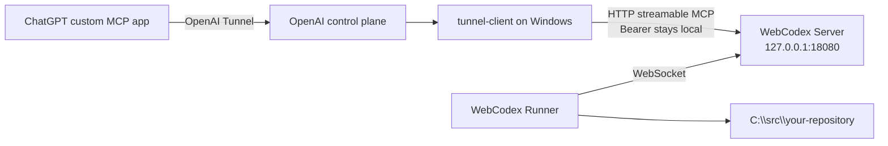
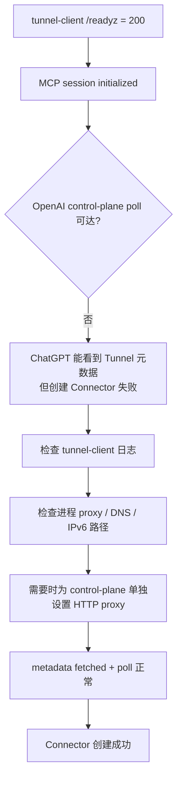

# Windows + OpenAI Secure MCP Tunnel 实操指南

[English](WINDOWS_OPENAI_TUNNEL.md) | [简体中文](WINDOWS_OPENAI_TUNNEL.zh-CN.md)

本文是当前 Windows 独立前台 WebCodex Server + Runner + OpenAI Secure MCP Tunnel 的深入配置指南。稳定的当前操作和排障步骤放在前面；文末单独保留 [2026-08-30 historical dogfood note](#historical-dogfood-note--2026-08-30)，用于保存真实验证证据，而不会让当时的版本、机器、项目、app 或 branch 看起来像当前配置要求。

## 适用场景

如果你的目标只是**正常长期使用 WebCodex**，先看[完整使用指南](PERSONAL_SETUP.zh-CN.md)。本文是 Windows + OpenAI Tunnel 的深入配置与故障排查记录，只有在你明确选择这条私有网络入口、需要复现实操拓扑或排查 Tunnel 问题时才需要继续阅读。

你希望 Windows 机器本身承担完整的 WebCodex runtime：

- WebCodex Server 运行在 Windows 前台；
- WebCodex Runner 作为独立 Runner 连接这个 Server；
- Server 不暴露公网端口；
- ChatGPT 通过 OpenAI Secure MCP Tunnel 访问 Server 的 `/mcp`；
- 后续可以像使用普通公网 Server + 正式 Runner 一样注册多个本机项目并进行读写。

如果只是临时分享一个仓库，优先使用更简单的：

```powershell
webcodex share --tunnel openai
```

本文重点是更底层的“独立 Server + 独立 Runner”拓扑，适合需要显式控制 runtime 生命周期或深入排查 Tunnel 的 Windows 环境。

## 整体结构



这里有两个重要边界：

1. ChatGPT 只选择 **Connection: Tunnel**，不需要拿到 WebCodex 本地 Bearer。
2. Runner 仍然是标准 WebCodex Runner；Tunnel 只解决 ChatGPT 到 MCP Server 的私有传输，不改变 Runner 连接 WebCodex 和操作 Project 的方式。

## 1. 前置条件

### WebCodex

安装当前 WebCodex，确保三个 Windows binary 来自同一版本/commit：

```powershell
webcodex --version
webcodex-server --version
webcodex-runner --version
```

不要把不同版本的 CLI、Server 和 Runner 混在一起排查网络问题；应先统一三个 binary baseline。2026-08-30 historical dogfood 的精确 build 只记录在文末历史部分。

### OpenAI Secure MCP Tunnel

需要已经创建好的 OpenAI Secure MCP Tunnel，并在 Windows 用户环境中配置：

```text
CONTROL_PLANE_TUNNEL_ID
CONTROL_PLANE_API_KEY
```

`CONTROL_PLANE_API_KEY` 建议使用只授予 Tunnels **Read + Use** 的 Restricted key。

不要把这两个值打印进终端日志、文档、issue 或截图。

WebCodex 会使用固定并校验的 OpenAI `tunnel-client`；当前实现也可以从 `WEBCODEX_TUNNEL_CLIENT_BIN` 或 `PATH` 解析它。

## 2. 初始化 Windows 前台 Server

选择独立 env/data 路径，避免影响机器上已有的 WebCodex runtime：

```powershell
$envFile = Join-Path $HOME ".config\webcodex\openai-tunnel\webcodex.env"
$dataDir = Join-Path $HOME ".local\share\webcodex-openai-tunnel"

webcodex server init `
  --listen 127.0.0.1:18080 `
  --data-dir $dataDir `
  --env-file $envFile `
  --json
```

`server init` 会创建 Server bootstrap/admin credential，并写入私有 env 文件。不要把该 token 当成 MCP 或 Runner credential。

然后在一个保持开启的 PowerShell 窗口运行：

```powershell
webcodex server run --env-file $envFile
```

确认 Server 正在 loopback 监听并提供本地 MCP endpoint：

```text
Listening on: 127.0.0.1:18080
MCP endpoint: http://localhost:18080/mcp
```

Windows 当前支持的是**前台 Server runtime**。关闭这个终端或按 Ctrl-C 会结束 Server。

## 3. Pairing、login，并启动独立 Runner

打开第二个 PowerShell 窗口，在 Server 侧创建短期 pairing code：

```powershell
webcodex pairing create `
  --server-url http://127.0.0.1:18080 `
  --env-file $envFile `
  --username windows-user `
  --display-name "Windows Runner" `
  --ttl-secs 600
```

在 Runner 侧兑换 code。建议把允许范围限制到真实项目父目录，例如：

```powershell
webcodex login http://127.0.0.1:18080 `
  --code <wc_pair_...> `
  --allowed-root C:\src `
  --json
```

`login --json` 会返回 `runner_config` 路径，但不会要求把 credential 粘贴给 ChatGPT。用返回的配置启动 Runner：

```powershell
webcodex runner run --config <login-reported-runner-config>
```

使用 `webcodex runner status --config <login-reported-runner-config>` 检查状态。此时 Server 应看到一个普通独立 Runner；在第一次显式注册项目之前，Runner 显示零个 Project 是正常的。

## 4. 先验证本地 MCP，再启动 OpenAI Tunnel

OpenAI `tunnel-client` 的关键目标是本机：

```text
http://127.0.0.1:18080/mcp
```

WebCodex Bearer 应保留在本机，通过 file-backed `Authorization` header 注入给 `tunnel-client`；不要把这个 Bearer 复制到 ChatGPT。

启动 daemon 前先运行 `doctor`，要求它同时验证：

- Tunnel ID；
- Restricted control-plane API key；
- 本地 WebCodex MCP；
- 本地 Bearer 注入。

成功后运行 Tunnel daemon，并为它配置健康检查：

```text
--mcp.server-url url=http://127.0.0.1:18080/mcp,channel=main
--mcp.extra-headers Authorization: file:<private-authorization-file>
--health.listen-addr 127.0.0.1:0
--health.url-file <private-health-url-file>
```

WebCodex 的 `share --tunnel openai` 会自动完成相同类别的准备、`doctor` 和 `/readyz` 等待。手工拓扑只建议用于本文这种独立 Server/Runner 场景或排障。

## 5. `/readyz` 正常但 ChatGPT 创建 Connector 失败

`/readyz = 200` 只说明本地 Tunnel/MCP 一侧能够通过健康检查，并不能证明 `tunnel-client` 已经能够获取 OpenAI Tunnel metadata 并持续完成 control-plane poll。

如果 ChatGPT 仍然创建失败，应检查 `tunnel-client` 日志中的 metadata/poll failure。浏览器能够联网也不能证明该进程使用相同 proxy、DNS 或 IPv6 路径。

排障时按两条链路分别判断：



如果该主机需要 HTTP proxy，先确认 proxy 本身能够访问 `api.openai.com`，再只把 **control-plane** 流量交给它：

```text
--control-plane.http-proxy http://127.0.0.1:<proxy-port>
```

修改 route 后，应同时确认本地 readiness 与 control-plane metadata/poll 都正常，再重试创建 Connector。文末历史部分保留了 2026-08-30 真实 Clash 故障，它正是这条当前排障规则的证据来源。

## 6. 在 ChatGPT Developer Mode 创建 Connector

在 ChatGPT 的新插件/custom MCP app 页面：

1. 名称：任意，例如 `WebCodex Windows`；
2. 连接选择 **隧道 / Tunnel**；
3. 从可用 Tunnel 中选择对应的 WebCodex Tunnel；
4. 身份验证选择 **无身份验证 / No authentication**；
5. 确认自定义 MCP 风险提示；
6. 点击创建。

为什么是 **No authentication**？

因为 OpenAI Tunnel 到本机 WebCodex MCP 的 Bearer 已由 `tunnel-client` 在本机注入。ChatGPT 不应该拿到或保存该 Bearer。

## 7. 通过 Connector 做端到端验收

Connector 创建成功后，如果当前对话还没出现新工具，先刷新 ChatGPT 窗口。然后验证真正的数据路径，而不只是 UI 创建成功：

1. 查看当前可见 Project；第一次注册前 `list_projects` 为空是正常的；
2. 使用当前 WebCodex Project workflow 注册或选择 `allowed_roots` 下的真实仓库；
3. 通过 Connector 读取一个已知文件；
4. 如果明确启用了写权限，用专用分支/安全小改动验证写入，并检查 Git diff。

WebCodex 返回的 Project handle 是结果，不是设置时需要用户自己编造的输入；不要让用户手工拼 Runner/project runtime id。

## 8. 推荐的验收清单

不要把“进程启动了”当成最终成功。至少验证以下层级：

| 层级 | 应看到的证据 |
| --- | --- |
| Windows Server | loopback listener 正常，`/mcp` 可达 |
| Runner | `actual_transport=websocket`，Runner online |
| Local MCP | `tunnel-client` 显示 `mcp session initialized` |
| Tunnel health | `/readyz = 200` |
| OpenAI control plane | metadata fetch 成功，poll 无持续失败 |
| ChatGPT | Connector 可以创建并 Scan/加载 tools |
| Project | 可以通过 Connector 注册真实 Runner path |
| Read | 可以通过新 Connector 读取仓库文件 |
| Write | 可以在专用分支创建/修改文件，并用 Git diff 验证 |

只有最后几项也通过，才说明它真的具有和普通 WebCodex Server + Runner 相同的开发使用体验。

## 9. 常见误区

### `/readyz = 200` 就代表 Tunnel 完全可用

不是。还必须确认 OpenAI control-plane metadata/poll 正常。

### ChatGPT 需要填写 WebCodex Bearer

OpenAI Secure MCP Tunnel 模式不需要。选择 **No authentication**，Bearer 保留在本机。

### Windows 一定需要 WSL 或 Windows Service

不需要。当前支持 Windows 前台 Server 和前台 Runner。缺点是终端关闭后进程也会结束；Windows managed service lifecycle 仍未提供。

### `share --tunnel openai` 和本文手工拓扑完全不同

底层核心链路相同：本地 WebCodex MCP + 本地 Bearer 注入 + OpenAI `tunnel-client`。区别是 `share` 自己管理临时 Server/Runner/session，而本文显式拆开 Server 和 Runner，便于验证长期拓扑和排障。

## Historical dogfood note — 2026-08-30

> 仅作为历史验证证据。上面的步骤描述当前支持行为。本轮 0.4 文档清理**没有**重新执行 2026-08-30 的 Windows 实验，因此下面的精确版本、commit、路径、app 名和 branch 都不能视为当前配置要求。

当时的环境是：

```text
WebCodex 0.3.9
commit 1fa862829122
Runner client_id=tutorial-msi-runner
preferred/actual transport=websocket
ChatGPT app=tunnel-test
```

独立 Runner 最初没有注册 Project，之后通过 Tunnel Connector 真实注册并访问了：

```text
E:\git\petal-meadow-3d
E:\git\webcodex
```

同一个 Connector 还用于创建本文最初的文档分支：

```text
docs/windows-openai-tunnel-guide
```

这次真实运行因此验证了：ChatGPT 可以经过 OpenAI Tunnel 到达 Windows 前台 Server，再到独立 WebSocket Runner，并完成真实 Project 注册、仓库读取和仓库写入。

第一次创建 Connector 时还出现了一个重要网络故障：本地 MCP 已初始化、`/readyz = 200`，但 OpenAI control-plane poll 仍失败，因为该 Windows 进程没有继承浏览器使用的 Clash 路由，`api.openai.com` 的直连 DNS/IPv6 路径不可用。当时验证可用的 Clash HTTP proxy 是：

```text
http://127.0.0.1:7890
```

只把 control plane 路由到该 proxy：

```text
--control-plane.http-proxy http://127.0.0.1:7890
```

之后 Tunnel log 显示 healthy proxy route 与正常 metadata/poll，Connector 创建成功。这是当前“浏览器联网和 `/readyz` 都不能单独证明 `tunnel-client` control-plane 可达”这一排障规则的历史证据。

以下截图也来自 2026-08-30 的 ChatGPT UI，仅作历史参考；当前 UI 文案可能变化：


## 相关文档

- [部署指南](DEPLOYMENT.zh-CN.md)
- [MCP](MCP.zh-CN.md)
- [CLI](CLI.zh-CN.md)
- [故障排查](TROUBLESHOOTING.zh-CN.md)
